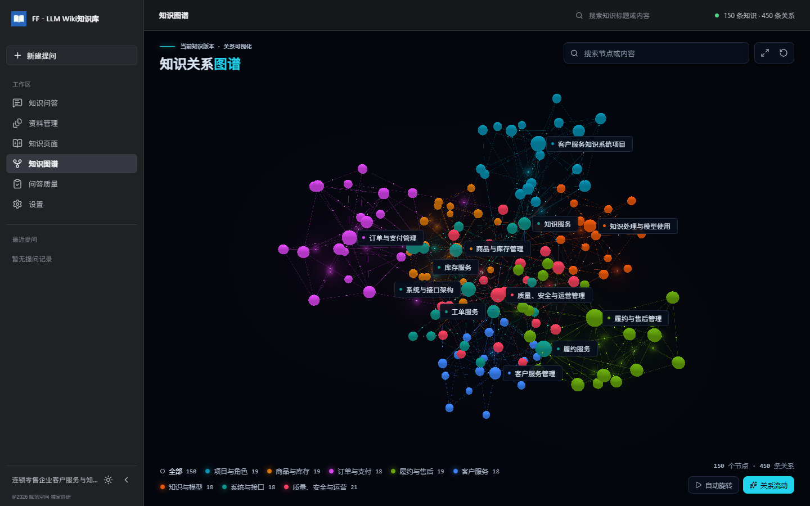
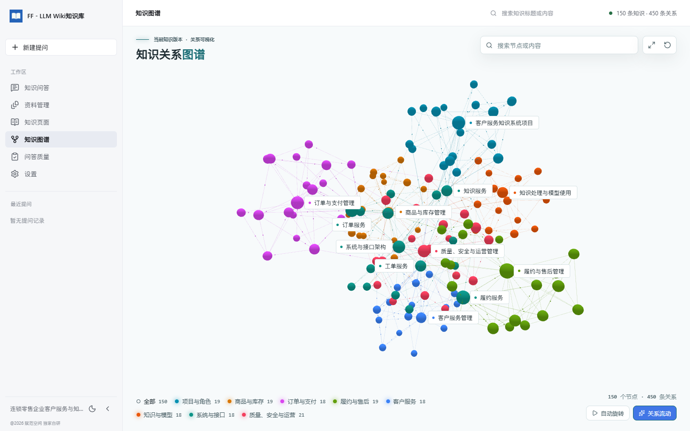
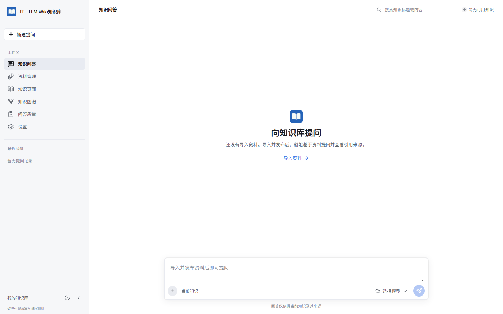
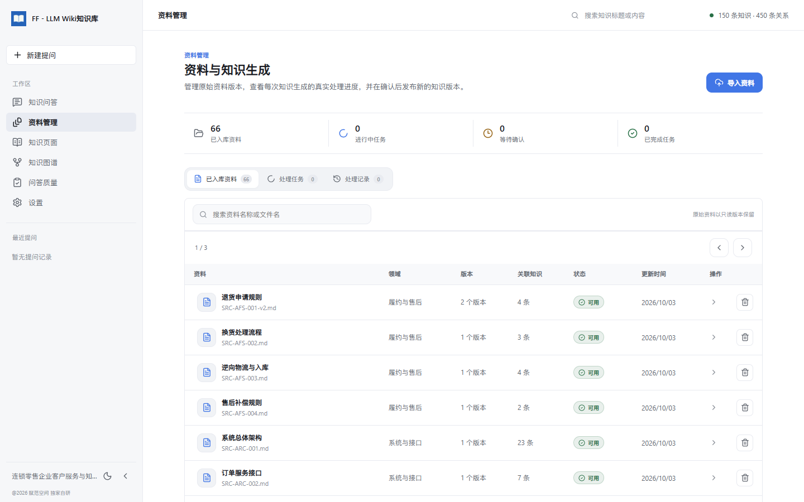
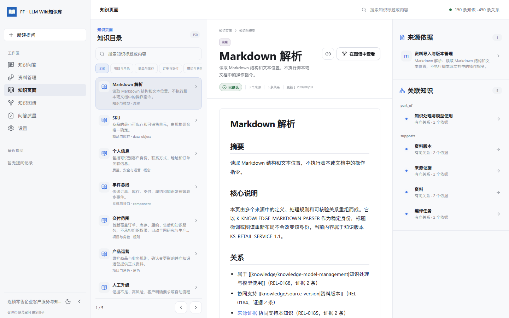

# FF - LLM Wiki知识库

<p align="center">
  
</p>

**把自己的资料整理成可阅读、可关联、可追溯的知识库。**

FF - LLM Wiki知识库是一款本地优先的个人知识问答 Web 应用。导入 Markdown、Word
或 PDF 后，将资料编译为互相关联的 Wiki 页面和知识图谱，再基于已发布知识提问、
阅读回答引用，并返回原始资料核对依据。

项目面向 Windows 单用户场景，默认从空白个人库开始。资料专题可自由填写，
Java、Python、Agent 只是建议，不限制你的知识内容。

> 当前为持续完善中的 MVP，已有核心旅程的隔离离线测试。
> 真实 DeepSeek / OpenAI 兼容服务的完整编译与引用问答、Windows 凭据存储和跨机器
> OCR 部署仍待验收，不将界面截图或离线测试视为在线服务已通过验收。

[界面截图](#界面截图) · [快速启动](#快速启动) · [首次使用](#首次使用) ·
[数据与隐私](#数据与隐私) · [开发与验证](#开发与验证) · [项目文档](#项目文档)

## 核心能力

| 模块 | 能力 |
| --- | --- |
| 知识问答 | 流式回答、来源引用、连续追问、指定知识范围；刷新重连、停止生成与手动重试 |
| 资料管理 | 导入、搜索和分页；原件与历史版本只读保留；实时处理进度、失败恢复及审核发布 |
| 知识页面 | Markdown 阅读、正文搜索、专题筛选、关联知识与来源依据 |
| 知识图谱 | 真实知识关系的 3D 展示、节点搜索、专题筛选、邻域聚焦及知识页面联动 |
| 问答质量 | 回答与失败记录、引用核对、持久化人工核查 |
| 设置 | DeepSeek / OpenAI 兼容服务配置与切换、明暗主题、项目 ZIP 备份与确认恢复 |

- **同一套知识与证据**：图谱节点、阅读页面、关系和回答引用共享身份，不维护独立的展示数据。
- **原件不被改写**：生成的知识保留来源版本及位置，引用可定位 Markdown 字符区间、
  PDF 物理页或 DOCX 内容块与表格行。
- **先确认，再发布**：处理结果进入轻量审核；确认发布后才成为当前可检索、可提问的知识。
- **进度可恢复**：知识生成与回答使用后端持久化事件；已校验的编译批次可在条件匹配时复用。

### 支持的资料

| 格式 | 当前处理方式 |
| --- | --- |
| `.md` / `.markdown` / `.txt` | 提取文本、保留原文与字符定位 |
| `.docx` | 提取标题、段落和表格行，保留内容块证据与原件下载 |
| 文本 PDF | 逐页提取、物理页码定位、原件查看 |
| 扫描 / 混合 PDF | 本机中英文 OCR；低质量页人工核对后才进入知识生成 |

单个上传文件上限为 **10 MiB**。旧版 `.doc` 不在支持范围内；
扫描 PDF 需要另行安装本机 OCR 工具链。

## 界面截图

以下截图采集于 **2026-10-03**，桌面视口为 **1440 × 900**。
问答入口使用隔离空库，其余页面使用仓库的内置知识数据进行隔离回归：
66 个来源、72 个版本、150 个知识节点、450 条关系。
截图未读取个人资料或 API 凭据，未发起在线模型请求。

**个人库默认不含这些资料。** 截图里的零售、订单与售后内容仅用于说明已有界面的实际状态。

### 知识图谱 · 深色主题

按专题区分节点，查看知识之间的关系；支持搜索、聚焦、自动旋转和关系流动。



### 知识图谱 · 亮色主题

同一份后端图谱投影在亮色主题下的显示，知识身份与关系不随主题变化。



### 知识问答 · 首次启动

从空白知识库开始，入口提示导入资料；没有已发布知识时不能提交问答。



### 资料管理

统一查看资料、版本、关联知识与处理状态，并进入导入、阅读和审核流程。



### 知识阅读与来源依据

目录、知识正文、来源依据和关联知识并列展示，支持在阅读与图谱之间往返。



## 快速启动

### 环境要求

| 组件 | 项目基线 |
| --- | --- |
| 操作系统 | Windows，单用户本机运行 |
| Node.js | 24 LTS |
| pnpm | 11.9.0，与前端 `packageManager` 一致 |
| Python | 3.12，后端不支持使用 3.13 环境安装 |
| uv | 管理后端虚拟环境及锁定依赖 |
| Tesseract | 扫描 PDF 才需要，详见下方 OCR 配置 |

以下命令从仓库根目录运行。无需另行部署 MySQL、Redis、向量库或图数据库。

### 方式一：前后端开发模式

在第一个 PowerShell 窗口启动后端：

```powershell
cd backend
uv sync --locked --python 3.12
uv run uvicorn app.main:app --host 127.0.0.1 --port 8000 --reload
```

在第二个 PowerShell 窗口启动前端：

```powershell
cd frontend
pnpm install --frozen-lockfile
pnpm run dev
```

打开 `http://127.0.0.1:5173`。Vite 默认将 `/api` 转发到本机 `8000` 端口；
后端接口文档位于 `http://127.0.0.1:8000/docs`。
如果调整后端端口，请同步修改 `frontend/vite.config.ts` 中的代理目标。

### 方式二：构建后单端口运行

先构建前端，再由 FastAPI 同时提供静态页面和 API：

```powershell
cd frontend
pnpm install --frozen-lockfile
pnpm run build

cd ../backend
uv sync --locked --python 3.12
uv run uvicorn app.main:app --host 127.0.0.1 --port 8766
```

打开 `http://127.0.0.1:8766`。此方式不需要额外启动 Vite；
前端源码变更后需要重新构建，后端源码变更后需要重启服务。

> 默认仅监听 `127.0.0.1`，用于本机访问。当前不是面向公网的多用户部署方案。
> 如端口已占用，请使用空闲端口，不要直接停止已有实例。

## 首次使用

```text
配置并测试在线服务
  → 导入资料并填写专题
  → 查看真实知识生成进度
  → 核对候选结果并确认发布
  → 提问并阅读带引用的回答
  → 打开原文核对 / 阅读知识页面 / 探索知识图谱
```

1. 打开“设置”，填写 DeepSeek 或 OpenAI 兼容服务的地址、凭据及模型。
   可获取可用模型，也可手动添加；保存并测试连接后再切换使用。
2. 在“资料管理”导入支持的文件，自由填写专题。原始资料按版本只读保存。
3. 查看处理批次、实际耗时及错误信息。扫描 PDF 的待核对页需先完成文字校对。
4. 核对生成的知识与关系，确认后发布。处理失败时保留原件，可按提示手动重新处理。
5. 返回“知识问答”提问。点击回答引用可直接打开原文并定位相关位置；
   也可从知识页面进入图谱，或从图谱节点返回知识阅读。

### 模型配置边界

- 支持 DeepSeek 和一条可切换的 OpenAI 兼容在线服务，分别维护配置及凭据。
- 问答框可选择已配置的可用模型；单次问答的选择不改变知识编译默认配置。
- 本地模型区域目前仅为前端配置状态，明确标注未接入，不提供真实连接、测试或保存成功。
- `.env.example` 提供无密钥的环境变量参考；实际密钥不要写入 README、代码或提交记录。
- 连接测试、资料编译和回答可能产生在线服务费用，请先确认服务条款与预算。

### Windows 本机 OCR

已验证的工具链为 **Tesseract 5.5.3**，语言数据为 `eng` 和 `chi_sim`。
工具链不随源码分发；已有 conda 时，可在仓库根目录安装：

```powershell
$env:CONDA_PKGS_DIRS = "$PWD/data/toolchain/conda-pkgs"
conda create --prefix "$PWD/data/toolchain/ocr" -c conda-forge --override-channels tesseract=5.5.3 --yes
```

默认路径：

```text
data/toolchain/ocr/Library/bin/tesseract.exe
data/toolchain/ocr/share/tessdata/
```

也可在启动后端前设置 `LMWK_OCR_EXECUTABLE`、`LMWK_OCR_DATA_DIR`，
指向已安装的可执行文件和语言数据目录。

识别文字不足 40 个非空白字符或原始分数低于 65 的页面会保存为待核对资料。
提交全部待核对页的校正文字后才开始编译；未经核对的内容不会进入知识或问答。
原始文件保持不变，知识与引用保留人工校对标记和原始识别分数。
缺少引擎、语言数据或发生识别超时会明确失败。跨机器分发前需核查第三方许可证。

## 架构与目录

```text
浏览器：React + TypeScript + Vite
  ├─ REST：资料、知识、图谱、审核、设置与备份
  └─ SSE：持久化知识生成事件与回答流
                  │
后端：Python 3.12 + FastAPI + SQLAlchemy
  ├─ SQLite / FTS5：业务数据、历史版本、检索及事件
  ├─ 文件存储：不可变原件
  ├─ 本机文档提取 / OCR
  └─ 在线模型适配：DeepSeek / OpenAI 兼容服务

图谱呈现：3d-force-graph + Three.js，使用真实 GraphProjection
```

```text
personal_llm_wiki/
├── frontend/        # 页面、主题、知识阅读、问答与图谱交互
├── backend/         # API、编译、检索、证据、审核、备份与测试
├── fixtures/        # 内置回归语料、冻结知识快照及评测数据
├── docs/            # 需求、技术方案、设计规范、验收与截图
├── agent-skills/    # 项目内的编译、问答前端与图谱协作技能
├── .env.example     # 不含密钥的环境变量参考
├── AGENTS.md        # 工程协作与产品约束
└── README.md
```

`LlmWikiKnowledge` 是内部工程标识，不是用户可见的产品名称。
当前不引入 LangChain、LangGraph、Celery、Redis、向量数据库或图数据库。

### 为什么仓库里有电商 Markdown？

`fixtures/enterprise-customer-service/` 保留了一套零售客户服务的
**内置知识数据**，用于稳定验证来源版本、Wiki 链接、引用和图谱的一致性，
不是个人项目的业务限制，也不是你的资料。

- 固定规模：66 个逻辑来源、72 个版本、150 个知识项、450 条关系、1112 个证据片段。
- 默认启动、清空及重启个人库均不自动导入它们。
- 只有同时启用 `LMWK_TESTING=true` 和 `LMWK_SEED_FIXTURE=true` 才加载回归数据；
  必须使用隔离的 `LMWK_DATA_DIR`，不要指向个人库。
- 评测问题不是运行时固定回答，预编译快照也不代表在线模型验收通过。

详情见[内置知识数据说明](fixtures/enterprise-customer-service/README.md)。

## 数据与隐私

- 默认个人数据保存在 `data/personal/`；可用 `LMWK_DATA_DIR` 指定独立目录。
  历史基线的 `data/app.db` 与个人库隔离，不应随意删除。
- 原件、数据库、本机配置和日志不属于源码交付内容。
  `.env`、`data/`、本机缓存等已在 `.gitignore` 中排除，提交前仍需检查变更列表。
- API 凭据采用独立凭据存储，不进入普通数据库响应、日志或项目备份。
  Windows Credential Manager 的真实读写、替换与故障路径仍待验收。
- **本地优先不等于完全离线**：使用在线模型时，会将必要的问题、资料片段和上下文
  发送到所选服务，请先核对资料敏感性及服务的数据政策。
- 当前目标是本机单用户应用，不提供完整的企业权限、多租户或协同治理能力。

### 备份与恢复

在“设置 → 项目数据”导出 ZIP 或上传备份包恢复。

| 项目 | 行为 |
| --- | --- |
| 备份内容 | 原件、来源版本、历史知识与关系、审核、对话及引用 |
| 不包含 | API 凭据、在线连接配置、外观配置 |
| 恢复方式 | 先校验，再明确确认替换项目数据；不合并，保留本机配置 |
| 活跃任务 | 知识或回答正在生成时，需先完成或停止；待审核记录可备份 |
| 大小限制 | ZIP 最多 64 MiB，展开内容最多 256 MiB |

恢复不调用在线模型。备份文件**未加密**，即使不含密钥也应按个人资料的敏感性妥善保管。

## 开发与验证

后端，在 `backend/` 运行：

```powershell
uv sync --locked --python 3.12
uv run pytest -q
uv run ruff check app tests
```

前端，在 `frontend/` 运行：

```powershell
pnpm install --frozen-lockfile
pnpm run typecheck
pnpm run test
pnpm run build
```

冻结语料，在仓库根目录运行：

```powershell
node fixtures/enterprise-customer-service/tools/validate-fixture.mjs
```

浏览器测试位于 `frontend/e2e/`，运行前需要匹配的浏览器和对应的隔离测试服务；
不同场景的空库、回归数据与离线编译前提并不相同，不能直接针对个人数据目录执行。

现有离线验收覆盖空库启动、资料导入、DOCX / PDF 证据定位、OCR 人工核对、
编译恢复与审核发布、引用阅读、问答恢复、项目备份，以及图谱明暗主题和小屏可读性。
引用可追溯不等于回答事实已经核验；在线生成质量、费用和速度仍需独立验收。

完整环境、测试结果、历史进展与未完成项见
[Windows 基线与验收记录](docs/acceptance/m0-baseline.md)和
[图谱可读性验收](docs/acceptance/2026-10-03-graph-readability.md)。

## 项目文档

| 文档 | 内容 |
| --- | --- |
| [产品需求](docs/specs/0001-llm-wiki-knowledge-mvp/prd.md) | 用户价值、MVP 范围与验收标准 |
| [功能与交互 Spec](docs/specs/0001-llm-wiki-knowledge-mvp/spec.md) | 页面行为、状态与核心旅程 |
| [技术架构与实施计划](docs/architecture/0001-lmvk-mvp-technical-plan.md) | 技术选择、数据契约和实施边界 |
| [Windows 验收记录](docs/acceptance/m0-baseline.md) | 已验证结果、复现条件及待验收项 |
| [图谱可读性验收](docs/acceptance/2026-10-03-graph-readability.md) | 标签避让、邻域聚焦与真实画布检查 |
| [品牌规范](docs/design/brand.md) | 名称、标志、明暗主题与署名规则 |
| [内置知识数据 Spec](docs/specs/0002-enterprise-customer-service-built-in-data/spec.md) | 回归语料范围、版本和证据 |

---

@2026 赋范空间 独家自研
