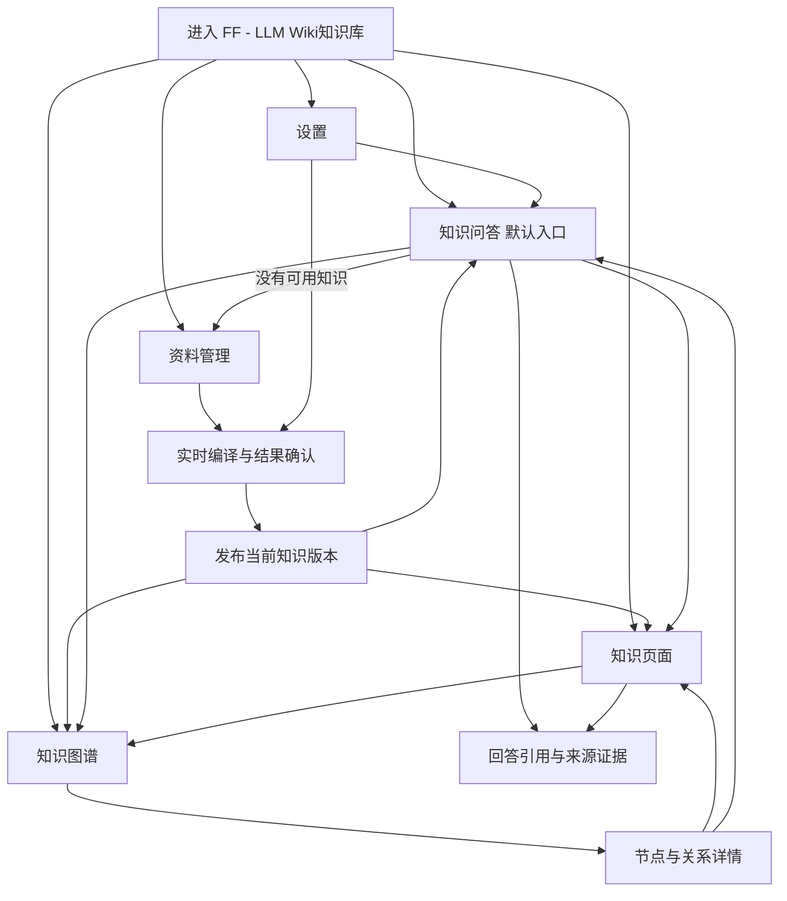

# FF - LLM Wiki知识库 MVP 产品需求文档

## 1. 文档信息

| 项目 | 内容 |
|---|---|
| 文档名称 | FF - LLM Wiki知识库 MVP 产品需求文档 |
| 版本 | v0.3.17 |
| 状态 | Windows 个人版实施范围已确认；按 M0-M4 分阶段验收 |
| 项目类型 | LLM Wiki 个人知识问答系统 |
| 作者 | 项目发起人 / Codex 整理 |
| 创建日期 | 2026-08-04 |
| 最后更新 | 2026-10-03 |
| 评审人 | 项目发起人 |

### 1.1 变更记录

| 版本 | 日期 | 变更 |
|---|---|---|
| v0.3.17 | 2026-10-03 | F-04/F-05 点击引用或来源卡直接打开对应版本的原文，自动定位高亮并保留前后文及关闭后的任务上下文。 |
| v0.3.16 | 2026-10-02 | F-02 按完整内容组织知识生成，展示真实批次及候选计数；失败或中断后复用仍有效的已完成结果，全部校验通过后才审核发布。 |
| v0.3.15 | 2026-10-02 | F-05 问题相关证据排序、停止回答及重启恢复；F-07 明确完整项目备份与确认替换恢复，不携带凭据及本机设置。 |
| v0.3.14 | 2026-10-02 | F-02 全文证据覆盖与关联来源重编译；F-05 引用失败恢复和有界连续追问；F-01/F-04 分页与知识正文搜索。 |
| v0.3.13 | 2026-09-28 | F-05 引用的原始资料在当前问答内预览，关闭后保留原对话和证据位置。 |
| v0.3.12 | 2026-09-28 | F-05 每条已保存的问答消息可单独删除；明确问题和回答的关联清理范围。 |
| v0.3.11 | 2026-09-28 | 问答质量作为第六个一级模块，与资料管理并列；保留原质量页地址跳转。 |
| v0.3.10 | 2026-09-28 | F-08 获取的全部模型纳入可用列表；不在设置页逐个选择，问答时选择模型。 |
| v0.3.9 | 2026-09-28 | F-08 允许 OpenAI 兼容服务使用远程 HTTP 地址，并明确明文传输风险；DeepSeek 仍使用 HTTPS。 |
| v0.3.7 | 2026-09-28 | F-08 增加可切换的 OpenAI 兼容在线服务；保留 DeepSeek 和本地模型未接入边界。 |
| v0.3.8 | 2026-09-28 | F-08 增加在线获取模型列表；F-05 允许每次问答选择已配置的在线服务及模型，编译默认配置不变。 |
| v0.3.6 | 2026-09-28 | 旧 `.doc` 不再使用；个人版 Word 导入仅支持 `.docx`，扫描 PDF 仍需完成 OCR 与复核。 |
| v0.3.5 | 2026-09-28 | Windows 个人版首次空库；Java/Python/Agent 资料；Markdown、Word 和文本/扫描 PDF 分阶段验收。企业数据改为仅显式回归。 |
| v0.3.4 | 2026-08-05 | 确认知识问答采用用户问题右对齐、知识回答左对齐的单一消息流，同一提交问题在流式期间不得重复显示；首次进入默认使用深色主题，同时保留跟随系统和浅色主题选项 |
| v0.3.3 | 2026-08-04 | 记录 DeepSeek API Key 已通过本地受限环境文件提供，且当前配置已通过官方模型列表连接检查；不改变产品范围与验收语义 |
| v0.3.2 | 2026-08-04 | 将产品语言统一为真实产品口径：公开说明、用户界面、内置来源和知识内容不再使用会让用户误解为非正式产品的措辞；内置数据仍通过完整真实链路运行 |
| v0.3.1 | 2026-08-04 | 锁定用户可见产品名 `FF - LLM Wiki知识库`、批准标志源文件及统一脚标 `@2026 赋范空间 独家自研`；仓库内部名称 `LlmWikiKnowledge` 保持不变 |
| v0.3.0 | 2026-08-04 | 批准 MVP 技术路线与实施边界：内置 Markdown 作为真实入库资料并可阅读，预置图谱经正式后端导入；仅 DeepSeek 在线 API 真实接入，本地模型只做明确未接入的前端形态；除该边界外 P0 链路全部真实开发和测试 |
| v0.2.2 | 2026-08-04 | 确认可由 Codex 从同一批 Markdown 内置资料预编译首个知识快照，但必须保留完整来源证据、共用正式数据契约，且不替代后续 DeepSeek 真实上传编译链路 |
| v0.2.1 | 2026-08-04 | 明确问答与知识图谱必须保留高完成度视觉效果，优先复用项目内两个前端 Skill 的选定模板源码，不得因专业命名、Apple 启发或双主题要求而清淡化 |
| v0.2.0 | 2026-08-04 | 确认 LMVK 知识问答系统形态：知识问答为默认入口，固定侧边栏承载五个一级模块，并补充资料处理、Markdown 阅读、模型配置与设置要求 |
| v0.1.3 | 2026-08-04 | 确认专业产品命名规则，禁止把模板名、隐喻式包装或非必要实现术语用作产品名称 |
| v0.1.2 | 2026-08-04 | 确认全局明暗双主题和 Apple 启发设计方向，并要求图谱与知识问答完整适配两套主题 |
| v0.1.1 | 2026-08-04 | 确认图谱优先工作台、3D 知识图谱和带来源引用的知识问答形态，并补充共享知识快照决策 |
| v0.1.0 | 2026-08-04 | 根据背景说明和前期 LLM Wiki 调研形成第一版 PRD |

### 1.2 文档定位

本文定义产品为什么做、为谁做、MVP 做什么，以及如何验收。

本文不在产品需求层重复前端框架、后端框架、数据库和部署细节。
已批准的技术路线、模型实现边界和接口方案记录在
`docs/architecture/0001-lmvk-mvp-technical-plan.md`。

### 1.3 Windows 个人版范围修订（v0.3.6）

本节优先于下文与之冲突的旧版默认内置数据、文件格式和 OCR 条款。产品首次启动必须是空白个人知识库：来源、知识、图谱、推荐问题均为空；各模块显示空状态和“导入资料”入口，不自动导入企业客服数据，清空后或重启后也不重新导入。企业 fixture 仅供显式离线回归，不能成为个人问答的默认证据。

F-01 / AC-F01-01～03 扩展为 Java、Python、Agent 资料的 `.md`、`.markdown`、`.docx`、文本型和扫描型 PDF 导入；旧 `.doc` 明确不在个人版范围。每次导入可填写自由专题（Java/Python/Agent 仅为建议，不是封闭分类）；来源、编译知识和图谱必须使用真实专题，无专题时归入通用知识。每个版本保留不可变原始文件及可读提取结果；引用可回到文件和页码或段落。扫描页低质量、损坏文件、缺失本机 OCR 依赖须可见失败或待复核，不得当作成功资料。M1 先验收空库和 Markdown/文本 PDF，M2 分别验收 DOCX 与扫描 PDF 的上传到可引用原文的完整流程。未经核对的 OCR 片段不得支持确定性回答。允许编译和问答把必要片段发送给当前选中的在线服务，但不得在仓库、文档、日志或接口中暴露密钥。

旧版关于“默认 66/72/150/450 内置项目”、首次预编译快照及“扫描件 OCR 不进入 MVP”的叙述仅描述原企业 fixture 回归方案，不再规定个人版默认行为。其他五模块、同源证据与引用约束继续有效。

## 2. 项目背景与目标

### 2.1 背景

项目发起人需要完成一个可长期运行、可讲解、可录制和可持续扩展的
完整 AI 知识产品。
项目需要体现从原始资料到结构化知识，
再到图谱探索和知识问答的产品链路。

该项目不以首版覆盖完整知识管理能力为目标。
相比功能数量，首版更关注产品形态、前端完成度、关键交互和可见结果，
尤其强调知识图谱带来的视觉辨识度和展示价值。

知识问答、资料管理、知识编译、轻量审核、知识阅读和图谱探索构成必要能力。
质量治理和数据控制需要存在，
但只做到足以支撑可靠运行和后续扩展的程度。

### 2.2 一句话定义

FF - LLM Wiki知识库面向知识工作者和 AI 项目创建者，
是一个以知识问答为默认入口的个人知识系统：
用户可以管理资料、查看知识生成过程、阅读 Markdown 知识页面、探索知识图谱，
并使用已配置的 DeepSeek 在线服务获得可追溯到来源的回答。

### 2.3 产品目标

- **G-01 完整链路**：用户从知识问答进入系统，能够完成资料导入、知识编译、
  轻量审核、知识阅读、图谱探索和带引用问答。
- **G-02 产品完成度**：知识问答符合成熟对话产品的使用习惯并保留精细流式、引用和来源交互，
  知识图谱保持 3D 空间、节点光效、关系流动和镜头聚焦等重点视觉效果，
  全部一级模块达到可公开展示的完成度。
- **G-03 结果可信**：图谱、知识页面和问答引用来自同一套知识对象，
  并能够回到原始来源。
- **G-04 快速交付**：严格控制功能广度，
  把主要投入集中到 P0 链路和视觉表现。
- **G-05 可继续开发**：遵循已批准的前后端边界和文档契约，
  使功能实现、测试和后续扩展具有统一依据。
- **G-06 可配置运行**：用户可以真实配置、验证并切换 DeepSeek 或 OpenAI 兼容在线服务，选择全局主题；
  本地模型分区只展示后续接入形态并明确当前版本尚未实现。

### 2.4 非目标

- 不建设企业级多租户、组织、角色权限和审计平台。
- 不建设多端实时同步、多人协作编辑和复杂冲突合并。
- 不追求首版支持所有文件格式和全部媒体类型。
- 不建设持续抓取互联网的自动研究或情报系统。
- 不以大规模生产负载、高可用集群或商业化计费为首版目标。
- 不把知识图谱做成与真实知识数据分离的静态动画或硬编码页面。

### 2.5 需要验证的产品假设

- H-01：以知识问答作为默认入口，比要求用户先理解图谱更符合首次使用习惯。
- H-02：来源、编译、知识页面、图谱和问答形成闭环后，有限功能也能呈现完整价值。
- H-03：图谱与阅读、证据和问答联动，比单独展示关系图更有价值。
- H-04：固定侧边栏和五个稳定一级模块能够降低学习成本，同时保留图谱的视觉辨识度。

## 3. 目标用户与画像

### 3.1 主要画像 P1：AI 项目创建者

- **背景**：使用 AI 辅助开发，
  需要完成真实知识产品的开发者、讲师或创作者。
- **目标**：用真实运行的项目展示 LLM、知识编译、图谱和前端产品能力。
- **痛点**：普通 RAG 项目同质化；只有聊天界面；图谱与数据脱节。
- **行为**：以桌面设备进行资料管理、开发、调试、讲解和录屏。
- **成功状态**：能顺畅完成输入、处理、结果查看和来源追溯。

### 3.2 次要画像 P2：个人知识工作者

- **背景**：有一批研究资料、课程材料、项目文件或主题笔记。
- **目标**：快速理解资料中的概念、实体、关系和跨文档结论。
- **痛点**：文件分散；笔记重复；不容易发现关系；AI 回答无法确认来源。
- **行为**：按项目导入资料，通过图谱、阅读和提问逐步探索。
- **成功状态**：能够从图谱进入知识页面，并从结论返回原始证据。

### 3.3 展示受众

评审者、潜在客户、学员或视频观众是展示受众，但不是主要操作用户。
他们需要在短时间内理解产品价值、处理过程和最终结果。

### 3.4 反画像

- 需要复杂权限、合规审批和海量并发的企业客户。
- 只需要精确全文搜索、不需要知识组织和图谱探索的用户。
- 需要实时行情、实时监控或高频数据分析的用户。

## 4. 用户故事与使用场景

### US-01 进入系统并开始提问

作为项目使用者，
我希望打开系统后直接进入知识问答，并看到可回答的推荐问题或导入资料入口，
以便不先学习系统结构就能开始使用。

### US-02 导入资料并生成知识

作为知识工作者，
我希望导入一批本地资料、在线查看文件并看到实时处理状态，
以便把分散内容编译成知识页面、实体和关系。

### US-03 在知识图谱中探索

作为知识工作者，
我希望通过精美、流畅的知识图谱查看主题、实体及其关系，
以便快速理解资料的整体结构并发现值得继续阅读的内容。

### US-04 阅读知识页面并核对证据

作为重视可信度的用户，
我希望通过专业 Markdown 阅读界面查看知识，也能从图谱节点或回答引用进入对应页面和原始资料，
以便确认知识结论不是脱离来源的模型生成内容。

### US-05 提问并获得带引用的答案

作为知识工作者，
我希望围绕当前知识库提问并获得来源引用和相关知识关系，
以便得到可验证而不是孤立的回答。

### US-06 轻量处理知识问题

作为项目维护者，
我希望看到缺少来源、处理失败或关系孤立等基础问题，
以便在不进入重型治理流程的情况下维持知识质量。

### US-07 配置模型与外观

作为系统使用者，
我希望在设置中配置、验证和切换 DeepSeek 与 OpenAI 兼容在线服务，了解本地模型当前的接入状态，
并选择浅色、深色或跟随系统，
以便明确系统实际可用能力并在不同环境中使用同一套产品界面。

### 4.1 P0 核心旅程契约

| 项目 | 契约 |
|---|---|
| 入口 | 用户进入系统后默认打开知识问答；没有知识时从问答空状态进入资料管理 |
| 主要动作 | 进入问答 → 导入 → 编译 → 审核 → 返回问答 → 查看引用 → 阅读或探索图谱 |
| 数据变化 | 来源产生处理状态，并生成知识、实体、关系和引用 |
| 主要容器 | 固定侧边栏、知识问答、资料管理、知识页面、知识图谱、设置 |
| 状态 | 空、处理中、部分成功、成功、失败、选中、聚焦 |
| 恢复 | 失败项可看到原因并重试，不要求重新创建整个项目 |
| 可见结果 | 图谱、知识页面和带引用回答均能回到同一份导入资料 |

## 5. 功能列表与范围

### 5.1 In-Scope

| ID | 功能 | 描述 | 故事 | 优先级 |
|---|---|---|---|:--:|
| F-01 | 资料管理 | 导入、在线查看和管理资料及处理状态 | US-01, US-02 | P0 |
| F-02 | 编译与轻审核 | 生成知识、关系、引用和审核摘要 | US-02, US-06 | P0 |
| F-03 | 可交互知识图谱 | 探索知识结构并联动证据 | US-03, US-04 | P0 |
| F-04 | 知识页面 | 通过 Markdown 阅读知识、关系上下文和原始来源 | US-04 | P0 |
| F-05 | 带引用知识问答 | 围绕当前知识库提问并返回可追溯答案 | US-05 | P0 |
| F-06 | 问题检查 | 展示基础质量问题 | US-06 | P1 |
| F-07 | 基础数据控制 | 导入、导出和确认清空 | US-01, US-06 | P1 |
| F-08 | 模型与外观设置 | 配置、验证和切换 DeepSeek 与 OpenAI 兼容在线服务，展示本地模型未接入状态并管理全局主题 | US-07 | P0 |

### 5.2 Out-of-Scope

- 账户注册、登录、多人组织、角色和权限。
- 实时协作、评论、审批流和消息通知。
- 自动全网研究、定时网页抓取和复杂连接器市场。
- 专业级 Wiki 富文本编辑器和多人版本合并。
- 高级图算法、社区检测、预测关系和图数据分析平台。
- 移动端 App 和小屏完整适配。
- 生产级计费、运营后台、SLA 和灾备体系。

### 5.3 优先级定义

- **P0**：核心产品链路，缺失则产品不可用。
- **P1**：提升完整性，但不阻塞首个可运行版本。
- **P2**：后续扩展，不进入当前交付承诺。

## 6. 详细功能描述

### F-01 资料管理

**触发**：用户从固定侧边栏进入资料管理、从问答空状态选择“导入资料”，
或加载内置知识数据。

**输入**：

- 一个或多个本地文件。
- MVP 验收格式：Markdown、纯文本和可提取文本的 PDF。
- 文件名称、大小、格式和导入时间等来源信息。

**核心流程**：

1. 页面提供“已入库资料”“处理任务”“处理记录”三个页内视图，不增加一级导航。
2. 用户选择或拖入资料，系统展示待处理项并校验基本可读性。
3. 用户确认后开始处理；每份资料显示等待、处理中、成功、部分成功或失败状态。
4. 成功资料进入知识编译，失败资料保留原因和重试入口。
5. 用户可以在线查看当前入库文件、来源版本、最近处理结果和生成的知识数量。
6. 用户可以重新处理失败文件；移除文件前必须说明对知识、关系和历史引用的影响并再次确认。
7. 用户可取消进行中的任务；已结束任务可单独删除处理记录，不撤销已发布知识。
8. 已入库资料支持分页查看，显示当前页和总数；搜索后从第一页展示命中资料，首尾页禁用不可用的翻页操作。

**输出**：

- 资料列表、来源详情、在线预览和处理状态。
- 可供后续编译与引用的来源身份。
- 导入成功、部分成功或失败的明确反馈。

**边界条件**：

- 重复文件：提示可能重复，避免静默生成重复知识。
- 空文件：标记失败并说明没有可处理内容。
- 不支持格式：保留文件信息，但不进入编译。
- 单项失败：不阻塞同批其他可处理资料。
- 内置资料：必须经过与普通资料一致的导入和编译契约。
- 内置资料：66 个逻辑来源和 72 个 Markdown 来源版本必须通过正式后端接入层导入资料管理，
  支持列表、版本和只读正文查看；不能只导入知识页面或图谱。
- Markdown 和纯文本：提供可读的在线预览，但预览不得改写原始来源。
- PDF：首版只处理可提取文本并展示引用定位；扫描件 OCR 不进入 MVP。
- 移出资料仅影响当前版本：引用该来源的知识页（含混合来源页面）及失效关系从当前知识、图谱和检索中移除；保留历史快照、证据和原件。没有有效知识时恢复空库；同内容资料可重新导入。
- 进行中任务须先取消再清理记录；取消不得发布未确认结果。删除已结束任务只清理任务及事件，不删除来源或历史引用。

### F-02 知识编译与轻审核

**触发**：资料成功进入当前项目，或用户对已有资料发起重新编译。

**输入**：

- 当前项目中的有效来源。
- 项目目标和基础知识类型约定。
- 已有知识页面、实体和关系。

**核心流程**：

1. 系统从资料中识别主题、实体、概念和关系。
2. 系统判断内容应新建知识还是补充已有知识。
3. 系统生成知识摘要、关系和来源引用。
4. 系统展示本轮新增、更新、冲突、警告和失败的摘要。
5. 用户可以接受本轮结果；存在问题的项目可以保留待处理状态。
6. 处理任务页实时展示当前阶段、已处理资料数、已生成知识数、关系数、警告和失败。
7. 用户离开资料管理后任务继续运行；侧边栏显示处理中或失败数量，重新进入后恢复真实状态。

**输出**：

- 知识页面、实体、关系和来源引用。
- 编译进度与结果摘要。
- 已接受、待审核、存在警告或失败的状态。

**边界条件**：

- 无法从来源获得足够证据：不生成确定性结论，标记证据不足。
- 新内容与已有知识冲突：同时保留冲突提示和相关来源。
- 部分资料失败：成功结果可继续使用，失败项可单独重试。
- 重新编译：不得静默删除仍被其他来源支持的知识。
- 用户离开界面：重新进入后仍能看到真实任务状态。
- 长资料：全部可编译正文都进入证据提取和生成请求，保留短段落及长段落尾部，不按固定段落数静默截断；证据不得跨越原文件页码或内容块边界。
- 来源更新：一并重新处理共同支持受影响知识的其他当前来源，发布后替换旧证据及关系，并移除本轮不再生成的受影响知识；未受影响知识和历史原件、证据、快照保留。
- 审核期间来源或当前知识版本变化：拒绝发布过期候选，明确原因并允许重新处理当前资料。

### F-03 可交互知识图谱

**触发**：项目中存在已生成知识，用户从固定侧边栏、知识页面或问答结果进入知识图谱。

**输入**：

- 当前项目的知识节点、实体节点、关系、类型和来源状态。
- 用户搜索、筛选、聚焦和选择操作。

**核心流程**：

1. 图谱以清晰、有层次的初始构图进入画布。
2. 用户可以缩放、平移、拖动、搜索、筛选和重新聚焦。
3. 悬停节点时突出直接关系并弱化无关内容。
4. 选择节点后展示详情、关联知识、来源数量和关系说明。
5. 选择关系后展示关系双方、含义和支持证据。
6. 用户可以从节点或关系进入知识页面或原始来源。

**输出**：

- 可探索的知识图谱和明确的选择状态。
- 与当前节点或关系关联的详情和证据入口。
- 可供问答使用的当前图谱上下文。

**边界条件**：

- 无知识：展示有行动指引的空状态，不展示伪造图谱。
- 数据量较大：仍保持可识别的层级，避免所有标签同时堆叠。
- 孤立节点：可见但具有区别状态，并能进入详情。
- 关系缺少证据：显示警告，不与已确认关系混淆。
- 浏览器或窗口尺寸变化：画布和控制区不被裁切或失去操作入口。

### F-04 知识页面

**触发**：用户从图谱、搜索结果、问答引用或知识目录打开知识项。

**输入**：

- 知识标题、正文、类型、状态、关系和来源引用。
- 当前选中的来源或引用位置。

**核心流程**：

1. 用户从知识目录搜索、筛选并打开知识页面。
2. 系统使用专业 Markdown 阅读界面展示正文、页面目录和基础元信息。
3. 阅读界面支持标题、段落、列表、表格、代码块、引用、链接、图片和页内锚点等常用 Markdown 语义。
4. 用户查看该知识与其他节点的关系；点击引用来源直接打开对应版本的原文，自动滚动到引用位置并高亮，保留前后文。Markdown、PDF 和 Word 提取文本使用一致的定位行为；原文读取失败时保留可用的证据上下文并支持重试。
5. 用户可以返回原来的图谱焦点或问答位置。
6. 知识目录分页显示当前页和总数，搜索覆盖标题、摘要和正文；搜索或筛选变化时回到第一页。顶栏搜索、目录搜索和阅读选择必须同步，不继续展示上次搜索选中的无关正文。

**输出**：

- 可搜索、可筛选、可阅读的 Markdown 知识内容。
- 关系上下文、来源列表和证据预览。
- 返回原任务上下文的稳定入口。

**边界条件**：

- 来源已失效：保留引用记录并明确提示不可访问。
- 内容过长：阅读位置和侧栏不互相干扰。
- 知识待审核：在正文区域明确展示状态。
- 无关联节点：不显示空的关系组件，以有意义的提示替代。
- 不可信 Markdown：脚本、事件处理器和其他主动内容不得执行。
- 首版提供专业阅读和来源追溯，不建设复杂富文本编辑器。

### F-05 带引用知识问答

**触发**：用户打开系统默认进入知识问答、点击“新建对话”、选择推荐问题，
或从知识页面和图谱上下文发起问题。

**输入**：

- 用户问题。
- 本次问答选用的已配置在线服务和模型；未指定时使用当前默认配置。
- 当前项目知识、来源和关系。
- 可选的当前图谱节点或阅读页面上下文。

**核心流程**：

1. 新对话首先显示问题输入区；存在可用知识时显示来自当前知识版本的推荐问题。
2. 没有可用知识时不展示不可回答的问题，改为显示进入资料管理的明确操作。
3. 用户选择推荐问题或提交自定义问题后，系统立即在右侧展示唯一一条已接收问题，知识回答在左侧流式生成；后端消息落库时替换提交中的临时显示，不得叠加成两条相同问题。
   输入区下方可选择本次回答使用的服务及模型；失败重试保留原选择，不改变知识编译的默认配置。
4. 系统从当前项目寻找相关知识和来源，生成答案并为关键结论提供可点击引用。
5. 系统展示与答案相关的知识节点或关系。
6. 用户点击正文引用、回答底部引用或来源卡时，在当前问答内直接打开对应版本的原始资料，自动滚动到引用位置并高亮，保留前后文，无需再点一次查看原文。关闭后仍停留在原对话和选中的证据位置；“查看来源”仍仅打开来源列表。知识页面和知识图谱保留各自入口。
7. 每条已保存的问题和回答均提供删除操作。删除回答时清理该回答、事件和质量审核，保留原问题；删除问题时连同由该问题产生的回答及其审核记录一并清理。删除须确认并在刷新后生效，不改变原始资料或已发布知识。
8. “最近提问”中的每条对话记录可独立删除。确认后该对话及其问题、回答、事件和质量审核从历史中移除；正在生成回答时拒绝删除并告知原因。删除当前对话后返回问答首页，不改变原始资料或已发布知识。

**输出**：

- 结构清晰的回答。
- 可点击的知识和来源引用。
- 与答案相关的知识关系上下文。
- 当前项目的最近对话和可继续的历史会话。

**边界条件**：

- 证据不足：明确回答无法从当前知识库确认，不编造引用。
- 问题超出项目范围：提示当前知识库覆盖范围。
- 生成服务失败：保留问题并提供重试，不显示虚假成功答案。
- 证据选取：从候选知识的全部引用片段按当前问题相关程度排序后限量选取，不能只取来源开头；追问可参考上一条问题，同分保留所选知识及检索顺序。
- 用户停止回答或服务重启：保存可见失败原因和手动“重新生成”入口，刷新后仍可恢复；不保存未校验片段为成功正文，不自动重试。同一对话同时只生成一个回答。
- 引用缺失或引用编号超出本次证据范围：回答进入失败状态，说明具体原因并允许重试；有效编号不代表结论已通过事实核查。
- 连续追问：利用同一会话近期用户问题理解省略或指代，结合当前所选知识检索；历史问题和回答都不得替代当前证据，已失效知识身份不进入新问题上下文。
- 回答尚在生成：暂不可删除关联问题，完成或失败后再删除，避免处理中产生孤立回答。
- 来源内容包含操作指令：只作为资料处理，不执行资料中的指令。
- 用户连续提问：明确当前问题和历史上下文，避免界面状态混乱。
- 推荐问题：必须绑定当前已接受知识版本，点击后走正常问答流程，不绑定固定答案。

### F-06 问题检查

**问答质量补充范围**：问答质量作为独立一级模块展示真实回答的完成、失败、证据不足和无引用状态，以及实际编译失败记录。用户可逐条打开原对话、引用来源和知识页面，并对已结束回答人工记录“核查通过”或“需处理”（含问题类别及说明）；记录绑定回答 ID、知识快照与原引用，重启后保留。未核查的回答不视为通过，证据不足不自动判错；人工核查也不等于自动验证事实。没有标注题集、预期证据和有序检索记录时，检索命中、证据覆盖、事实忠实度及跨版本可比成绩均为“未评估”，不得显示虚构分数或默认基线。

**触发**：用户打开项目问题列表，或一次编译任务结束。

**输入**：

- 处理失败、待审核、证据不足、孤立节点和无效引用等基础状态。

**核心流程**：

1. 系统按类别展示问题数量和影响对象。
2. 用户选择问题后进入相关资料、知识或图谱位置。
3. 用户可以重试可恢复问题或确认暂时忽略提示。

**输出**：

- 简明问题摘要和可执行的问题列表。

**边界条件**：

- 没有问题：显示“未发现问题”，不制造无意义告警。
- 问题尚不可自动修复：提供定位信息，不伪装成一键修复。
- 问题对象已删除：刷新状态并移除失效入口。

### F-07 基础数据控制

**触发**：用户进入项目数据设置并选择导出、导入或清空。

**输入**：

- 当前项目资料、知识、关系、审核状态和必要配置。
- 用户选择的项目包或清空确认。

**核心流程**：

1. 用户选择导出时获得完整项目备份，包含全部原件、来源版本、知识版本、关系、编译与审核记录、对话及引用，不包含 API 凭据、在线连接配置和本机外观设置。
2. 用户选择恢复文件后，系统先校验并显示项目名与资料、版本、知识、对话数量；用户明确确认替换当前项目后才写入，不做合并。当前本机模型与外观配置保留。
3. 用户选择清空时必须看到影响范围并再次确认。

**输出**：

- 成功导出的项目包，或完成恢复后的项目。
- 明确的数据操作结果和失败原因。

**边界条件**：

- 项目包损坏或版本不兼容：拒绝导入且不破坏当前项目。
- 回答或知识生成尚未结束：禁止备份和替换恢复，提示完成或停止后重试；待审核任务可以备份。
- 恢复期间失败：当前项目仍完整可用；恢复不调用模型服务，也不改写已有原件字节。
- 导出失败：保留当前数据并提示重试。
- 清空操作：取消确认时不得产生任何数据变化。

### F-08 模型与外观设置

**触发**：用户从固定侧边栏底部进入设置。

**输入**：

- DeepSeek 的 HTTPS 服务根地址与 OpenAI 兼容服务的 HTTP 或 HTTPS 服务根地址，以及各自的配置名称、可用模型列表和 API 凭据。使用 HTTP 时明确提示 API 凭据、提问及资料片段将明文传输。
- 可从服务在线读取全部模型或手动添加；保存配置后在问答框选择。已有默认模型继续用于连接测试和知识编译，首次配置取列表第一项。
- 当前使用的在线配置。
- 本地模型连接名称、服务地址和模型标识的前端展示字段，不作为可运行配置提交。
- 主题偏好：跟随系统、浅色或深色。
- 减少动态效果偏好。

**核心流程**：

1. 用户修改 DeepSeek 或 OpenAI 兼容在线配置，填写服务根地址和 API 凭据。
   可在保存前读取服务的全部模型或手动添加，保存配置时持久化完整列表；在线读取不保存草稿凭据，也不生成回答。
2. 用户执行连接测试，系统调用对应的真实服务并返回成功或失败结果及可理解原因。
3. 用户可将通过测试的配置设为当前模型；知识编译和问答共用这一配置，切换后可以切回。
4. 本地模型分区展示未来需要的专业字段，同时持续说明“当前版本暂未接入本地模型”；
   不提供可产生假成功的保存、测试或设为默认动作。
5. 用户选择全局主题和减少动态效果偏好，保存后立即应用到全部一级模块。

**输出**：

- 两条在线配置各自的可用、不可用、未测试或配置不完整状态。
- 本地模型的明确未接入状态。
- 当前在线配置和全局外观偏好。

**边界条件**：

- 凭据只允许写入或替换，不在页面、日志、导出包或接口回读中显示明文。
- 在线服务不可访问或凭据失效时，显示真实原因和重新测试入口；未经测试或测试失败的配置不能设为当前模型。
- 当前配置不可用时，资料仍可查看，但新资料编译和问答必须明确阻止并提供进入设置的操作。
- 切换在线配置只影响后续任务，不静默重写已发布知识或历史回答；凭据互不覆盖。
- 本地模型字段不调用后端、不进入连接验证，也不得显示“已保存”“已连接”等成功状态。
- 凭据存储、超时、调用与错误边界遵循已批准的技术计划。

## 7. 非功能需求

### 7.1 视觉品质

- 以桌面端 1440 × 900 视口作为首要设计和验收尺寸。
- 知识问答是系统默认入口；知识图谱是独立一级模块和重点视觉页面，而不是附属统计卡片。
- 固定侧边栏必须稳定呈现知识问答、资料管理、知识页面、知识图谱、问答质量和设置六个一级模块，
  并提供新建对话和最近对话入口。
- 图谱、阅读器、来源预览和问答必须共享一致的视觉语言和状态语义。
- 所有用户可见界面都必须继承浅色和深色主题；MVP 以 P0 全覆盖为硬门槛，首次进入默认使用深色主题，用户可手动选择浅色、深色或跟随系统。
- 整体采用 Apple 启发的简洁、克制、内容优先设计语言，强调清晰层级、留白和精细材质。
- “简洁、克制、专业命名”只约束信息层级和产品语言，不意味着把界面改成普通白底或静态页面；
  问答和图谱必须保留有业务反馈意义的高完成度光效、动效、材质层次和空间效果。
- 图谱和知识问答必须分别完成真正的明暗适配，不使用全页面反色或深色画布外包浅色框架冒充适配。
- 主题切换不得重置任务状态、图谱视角、选择、阅读位置或问答上下文。
- 所有主要操作具备默认、悬停、聚焦、禁用、加载、成功和错误反馈。
- 动效用于解释结构、选择和转场，不使用影响信息阅读的持续装饰动画。
- 页面不能呈现为通用后台模板或只有侧边栏切换的扁平页面集合。

### 7.2 性能与响应

- 在内置知识项目已完成编译时，知识问答首个可操作界面 p95 不超过 2.5 秒。
- 在默认 150 个节点、450 条关系的知识图谱中，平移和缩放无明显卡顿。
- 图谱筛选、聚焦和节点选择应在 500 毫秒内给出可见结果。
- 导入、编译和问答操作应在 300 毫秒内显示真实的处理中状态。
- 长任务不得通过无变化界面让用户误以为操作没有发生。
- 切换一级模块不得中断后台编译或丢失对话输入草稿。

### 7.3 可靠性与数据一致性

- 单一资料处理失败不得导致整个项目不可使用。
- 图谱、阅读器和问答引用中的同一知识对象必须保持身份一致。
- 不得用与资料和知识数据无关的硬编码结果通过核心验收。
- 危险数据操作必须显示影响范围并要求确认。
- 页面刷新或重新进入后，已完成和失败的任务不得被伪装成初始状态。

### 7.4 安全与隐私

- 模型凭据和其他密钥不得出现在页面、日志、导出包或版本库中。
- 模型设置中的凭据不得回显明文；连接测试结果不得泄露请求头、密钥或完整服务响应。
- 用户导入内容被视为不可信资料，不能因为文档内文字而触发系统操作。
- 模型生成内容必须与原始来源在视觉上可区分。
- 无证据结论不得被标记为已确认知识。
- 首版不上传或分享资料，除非后续技术路线明确需要且获得用户确认。

### 7.5 可访问性

- 关键控件支持清晰的键盘焦点状态。
- 关系类型和状态不能只依赖颜色表达。
- 重要文本与背景达到可读对比度。
- 用户偏好减少动态效果时，核心操作仍完整可用。

### 7.6 兼容与语言

- MVP 以现代桌面浏览环境或桌面应用窗口为目标。
- MVP 只要求简体中文产品界面。
- 小于目标桌面尺寸时允许降低信息密度，但不能隐藏核心恢复操作。

### 7.7 产品语言与命名

- 用户可见产品名称固定为 `FF - LLM Wiki知识库`；不使用 `LMVK`、`LlmWikiKnowledge` 或其他缩写替代。
- `LlmWikiKnowledge` 只作为仓库目录和必要的内部工程标识保留。
- 所有用户可见名称必须来自真实任务、业务对象、可执行动作或可观察状态。
- 导航、模块、面板、按钮、字段、状态、提示、图谱节点和关系类型使用一致、稳定的业务词汇。
- 优先使用“资料”“知识”“知识图谱”“来源”“引用”“审核”“知识问答”等直接名称。
- 模板名、展示标签和技术实现词不得直接成为产品导航、标题、控件或状态文案。
- 正常产品界面不得使用“驾驶舱”“XX 舱”“星空”“深空”“宇宙”“中枢”“大脑”“魔法”等隐喻式包装。
- RAG、模型、索引等实现术语仅在技术文档、诊断信息或明确面向技术角色时使用；普通界面改写为任务语言。
- 同一产品概念只使用一个名称；用户无需理解内部实现或学习发明词汇即可判断其作用。
- 产品标志使用 `docs/assets/brand/ff-llm-wiki-logo.png`，保持原图的黑色方形画布、白色图形、颜色和比例。
- 出现脚标、版权或研发署名时，统一使用 `@2026 赋范空间 独家自研`，不擅自替换字符或翻译。

## 8. UI 与交互说明

### 8.1 信息架构

一级导航固定为知识问答、资料管理、知识页面、知识图谱、问答质量和设置。
编译与结果确认属于资料管理；节点、关系、来源和引用详情属于对应页面内的详情区域；
问答质量独立展示回答核查和失败记录，基础数据控制属于设置的后续能力，不再增加一级入口。

### 8.2 关键界面

#### A. 固定侧边栏与系统主界面

- 侧边栏顶部展示批准标志和完整产品名“FF - LLM Wiki知识库”，并提供“新建对话”。
- 一级导航依次提供知识问答、资料管理、知识页面和知识图谱；设置固定在底部。
- 资料正在处理时，资料管理入口显示处理中或失败数量；最近对话在侧边栏内可切换。
- 进入系统根入口时默认激活知识问答；刷新具体页面时恢复该页面和真实任务状态。
- 页面主区域顶部展示当前页面名称、当前知识状态和全局搜索，不放置虚假账号、套餐或模型选择器。

#### B. 知识问答界面

- 新对话显示克制的问题输入区和来自当前知识版本的推荐问题。
- 没有知识时显示导入资料操作，不展示无法回答的推荐问题。
- 回答、引用、相关知识和来源详情形成联动；点击推荐问题必须经过正常问答流程。
- 引用详情按需在页面右侧打开，不把来源面板永久占据所有页面。
- 保留流式回答、光标反馈、引用角标聚焦、来源卡高亮与展开、面板过渡和即时操作反馈，
  不得退化为普通文本框加静态消息列表。

#### C. 资料管理与编译界面

- 页面内部提供“已入库资料”“处理任务”“处理记录”，不拆成新的一级模块。
- 清楚呈现“尚未导入、等待、处理中、部分成功、成功、失败”。
- 编译过程展示真实阶段和对象计数，结果优先展示新增知识、更新知识、关系和问题摘要。
- 用户可以在线查看入库文件，从失败或警告回到具体资料和可恢复操作。

#### D. 知识页面

- 页面包含知识目录、Markdown 正文、页面目录、相关知识和来源证据。
- 标题、列表、表格、代码块、引用、链接和页内锚点具有专业阅读效果。
- 从图谱或回答进入后保留返回原位置的路径，来源引用可以定位到证据上下文。

#### E. 知识图谱

- 图谱占据主要视觉空间。
- 顶部或浮层提供搜索、筛选、重置视角和图谱摘要。
- 节点详情在不完全遮挡图谱的容器中展示。
- 当前选择、邻接关系、来源状态和问答关联具有明确视觉层级。
- 保留 3D 空间层次、节点外围光效、沿关系流动的粒子、镜头聚焦和稳定布局等效果；
  效果必须由真实节点、关系、权重和选择状态驱动。

#### F. 设置

- DeepSeek 与 OpenAI 兼容在线设置支持分别配置、真实连接测试和切换当前配置。
- 本地模型设置区只展示未来接入所需字段，并明确“当前版本暂未接入本地模型”；
  不显示可产生假结果的保存、测试或设为默认动作。
- 外观设置区支持跟随系统、浅色、深色和减少动态效果。
- 不展示套餐、价格、无真实后端能力的模型选项或会误导实现状态的供应商装饰。
- 基础数据控制在 P1 进入设置，不增加新的一级模块。

### 8.3 视觉方向要求

- 整体应呈现专业、克制、有空间层次的知识探索工具，
  而不是通用管理后台。
- 非图谱界面遵循 Apple 启发的内容优先、清晰排版、克制留白、细腻层级和轻量动效，
  但不复制 Apple 品牌素材或具体系统界面。
- 图谱通过语义层级、聚焦和关系变化产生吸引力，
  不依赖无意义特效。
- 问答与图谱不是清淡化的通用后台页面。问答通过精细材质、流式反馈、引用联动和来源展开体现完成度；
  图谱通过 3D 空间、节点光效、关系流动和镜头移动形成核心视觉效果。
- 深色图谱使用深色画布和克制的节点光效；浅色图谱使用明亮中性画布，
  两套主题保持相同知识语义、布局、交互能力和效果层级；浅色主题不得退化为纯白静态画布。
- 知识问答、阅读器、来源面板、资料和编译工作区使用同一套语义 token，
  并分别调校浅色与深色状态。
- 设计阶段必须给出两套主题下的图谱空态、全景、聚焦、详情展开和问答联动状态。
- 精确色值、字体、材质和动效参数在独立设计阶段确认，
  但双主题和 Apple 启发方向不再作为开放问题。
- 实现时优先复用项目内 `chatbot-frontend-templates-pack` 的 RAG 引用模板与共享层，
  以及 `knowledge-graph-viz-pack` 的深色 3D 图谱模板、数据契约和共享样式；
  只替换模板示例文案、样例数据和非生产逻辑，不无理由重写已经具备的视觉和交互实现。

## 9. 验收标准

### AC-F01-01：批量导入成功

**Given** 用户位于没有可用知识的问答空状态，且准备了有效的 Markdown、文本和 PDF 文件

**When** 用户一次导入这些文件并确认处理

**Then** 每个文件出现独立状态；成功文件进入编译；
失败文件不阻塞其他文件

### AC-F01-02：不支持的资料可恢复

**Given** 用户选择了不支持或不可读取的文件

**When** 系统完成基本校验

**Then** 界面明确说明失败原因，并保留移除或重新选择的操作

### AC-F01-03：入库资料可以在线查看

**Given** 当前项目已经导入内置或用户上传的 Markdown、纯文本或可提取文本的 PDF

**When** 用户在资料管理中打开其中一个文件

**Then** 系统展示文件版本、处理状态和可读内容；Markdown 以阅读视图呈现，
查看过程不改写原始来源

### AC-F01-04：移出资料及清理任务

**Given** 当前项目有已发布知识、含混合来源的知识页以及处理中或已结束的任务

**When** 用户在对应页内视图确认移出资料、取消进行中任务或删除已结束记录

**Then** 移出后当前知识、关系、图谱、检索与剩余资料计数同步更新，历史快照、证据及原件仍可访问；取消后后台任务停止且不能发布；删除记录后任务及事件消失，已发布知识不变。失败应可见并可重试。

### AC-F01-05：资料列表完整可达

**Given** 个人库资料数超过单页容量

**When** 用户翻页并搜索某份资料

**Then** 全部资料可通过分页访问，搜索回到第一页，页数、总数及翻页边界正确。

### AC-F02-01：生成真实知识对象

**Given** 当前项目至少有两份包含共同主题的有效资料

**When** 知识编译成功结束

**Then** 系统生成知识、实体、关系和引用，且引用能够定位到导入来源

### AC-F02-02：编译部分失败

**Given** 同一批资料中至少一份处理成功、一份处理失败

**When** 编译任务结束

**Then** 成功知识可继续浏览，失败项显示原因和重试入口

### AC-F02-03：轻量审核可见

**Given** 一轮编译产生新增、更新和警告结果

**When** 用户查看编译摘要

**Then** 用户可以区分结果类型，并接受可用结果或定位问题对象

### AC-F02-04：编译过程实时可见

**Given** 当前项目正在处理一批资料

**When** 用户查看处理任务、切换到其他一级模块后再返回，或刷新页面

**Then** 系统持续展示真实阶段、资料数、知识数、关系数、警告和失败；
切换页面不会中断任务，重新进入不会退回虚假初始状态

### AC-F02-05：长资料证据完整覆盖

**Given** 资料包含短段落、超过一页的段落或超过单次处理容量的正文

**When** 系统提取证据并生成候选知识

**Then** 所有非空正文片段进入生成请求，原文区间可追溯且不跨页或内容块；生成输入按标题或完整问答组织，在处理限制允许时不拆散同一内容；分批处理进度及候选数量来自真实结果，失败不会发布不完整结果。失败或中断后重新处理时，复用仍适用于当前资料、专题、在线服务和知识版本的已完成结果，否则重新生成。

### AC-F02-06：更新发布不保留过期知识

**Given** 当前知识由一份或多份来源支持，用户更新其中一份资料

**When** 用户重新处理并确认发布

**Then** 共同支持受影响知识的当前来源一并处理，过期证据、关系及不再生成的受影响知识退出当前版本，未受影响知识与历史原件、证据、快照保留；审核期间资料或知识版本变化时拒绝发布并提供重新处理入口。

### AC-F03-01：图谱完整呈现

**Given** 项目存在已接受的知识和关系

**When** 用户进入图谱主视图

**Then** 节点和关系在主要画布中可见，图谱不是预先写死的独立数据

### AC-F03-02：图谱探索联动

**Given** 图谱中存在相连节点

**When** 用户悬停并选择其中一个节点

**Then** 直接关系被突出；详情显示关联知识和来源入口；无关内容被弱化

### AC-F03-03：关系证据可追溯

**Given** 用户选择一条具有来源支持的关系

**When** 用户打开关系详情

**Then** 系统展示关系含义、两端节点和可进入的支持证据

### AC-F03-04：图谱空状态

**Given** 项目尚未生成任何知识

**When** 用户进入图谱区域

**Then** 系统展示导入或编译指引，不展示伪造节点和关系

### AC-F04-01：阅读与来源往返

**Given** 用户从图谱打开一个带引用的知识节点

**When** 用户查看引用并返回

**Then** 系统直接打开对应版本的原文，自动定位高亮引用并保留前后文；读取失败可重试，并能返回原来的知识和图谱焦点

### AC-F04-02：Markdown 知识页面完整可读

**Given** 一个知识页面包含标题、列表、表格、代码块、引用、链接和来源引用

**When** 用户从知识目录、图谱或回答打开该页面

**Then** 所有内容以清晰的 Markdown 阅读结构显示，页面目录和来源定位可用，
导入内容中的脚本和事件处理器不会执行

### AC-F04-03：正文搜索与分页同步

**Given** 知识数超过单页容量，目标词只出现在某页正文中

**When** 用户翻页、搜索正文词，再从顶栏提交其他查询

**Then** 正文命中可打开并追溯来源；搜索重置页码，目录输入、地址和阅读选择同步，全部知识可通过分页访问。

### AC-F05-01：问答带有可用引用

**Given** 当前知识库包含能够回答问题的来源

**When** 用户提交相关问题

**Then** 回答中的关键结论带有可点击引用；正文引用、底部引用和来源卡均可一次点击打开正确版本的原文并定位高亮，关闭后保留原回答和证据选择，同一资料的不同引用分别定位各自位置

### AC-F05-02：证据不足不编造

**Given** 当前知识库不包含回答某问题所需的证据

**When** 用户提交该问题

**Then** 系统明确说明无法确认，不生成虚假来源或确定性结论

### AC-F05-03：问答与图谱联动

**Given** 一个回答涉及图谱中已有的多个节点

**When** 回答完成

**Then** 用户能够查看相关节点并从回答进入对应图谱上下文

### AC-F05-04：问答是默认入口并提供真实推荐问题

**Given** 用户打开 FF - LLM Wiki知识库系统根入口

**When** 知识问答页面完成加载

**Then** 左侧“知识问答”处于选中状态；存在当前知识版本时展示来自该版本的推荐问题，
点击后经过正常问答流程；没有知识时展示“导入资料”，不展示固定答案或不可回答的问题

### AC-F05-05：每次问答可选择在线模型

**Given** 至少一条在线配置已通过连接测试，且当前知识版本可用

**When** 用户从提问框下方选择服务和模型并提交问题，或重试失败的回答

**Then** 本次回答使用所选服务与模型并记录所用标识；失败重试保留原选择，不更改知识编译的当前默认配置；未配置的服务和本地模型不可选

### AC-F05-06：无效引用不能作为成功回答

**Given** 本次回答已经取得可用证据

**When** 生成结果没有引用或包含超出本次证据范围的引用编号

**Then** 回答保存为失败，保留问题及具体错误原因并提供重试；即使同时存在有效引用也不得按成功回答接受。

### AC-F05-07：追问使用当前证据

**Given** 用户在同一会话中已提问，或从当前知识页面进入问答

**When** 用户提交含指代的追问，且来源可能已更新

**Then** 系统利用近期用户问题和仍有效的所选知识理解上下文，以当前接受知识版本的证据生成引用，不以历史回答或失效知识支持新结论。

### AC-F05-08：问题相关证据在限量前排序

**Given** 候选知识引用超过单次回答限量的证据，且与问题相关的片段位于末尾

**When** 用户提交中文或英文问题

**Then** 系统先对全部去重候选片段按问题相关程度排序，再限量选取；相关末尾片段可进入本次证据，来源版本和定位保持不变。同分顺序稳定；不据此宣称语义检索或事实核验完成。

### AC-F05-09：刷新、停止及中断后可恢复回答

**Given** 对话有正在生成的回答

**When** 用户刷新对话、停止回答，或服务中断后重新启动

**Then** 刷新会重连同一活跃回答；停止或服务中断保存明确失败记录，刷新后仍可见并可手动重新生成。未校验片段不作为成功正文，不自动调用模型重试，同一对话不能并行生成回答。

### AC-F06-01：基础问题可定位

**Given** 项目存在处理失败、无来源或孤立节点

**When** 用户打开问题摘要并选择问题

**Then** 系统进入相关资料、知识或图谱位置，并提供可执行的下一步

### AC-F06-02：真实问答可核查

**Given** 项目有已结束的真实回答，或个人库尚无任何回答

**When** 用户从一级导航打开问答质量，查看逐条结果并提交人工核查

**Then** 只展示项目真实回答、来源引用和知识版本；核查结果持久化并可修改或清除；无回答时显示空状态，未具备判定前提的质量指标显示“未评估”。

### AC-F07-01：完整项目备份经确认恢复且不破坏当前数据

**Given** 项目包含原件、来源版本、知识、关系、审核和带引用的对话

**When** 用户导出备份并选择恢复文件

**Then** 导出包不含凭据、在线连接和外观配置；恢复前显示项目摘要并要求明确确认替换，取消或缺少确认不改变当前数据。确认后原件字节、历史版本、引用和关系保持一致，本机配置保留，检索可用且不调用模型。

**And** 损坏、不兼容、引用缺失的包被拒绝；任务正在生成时禁止导出或替换；恢复写入失败回滚，当前项目仍完整可用并显示明确原因。

### AC-F08-01：在线配置可验证和切换且本地模型边界明确

**Given** 用户进入设置，准备了 DeepSeek 和 OpenAI 兼容服务的连接信息，并打开本地模型分区

**When** 用户分别保存配置、执行连接测试、切换当前在线服务并查看本地模型状态

**Then** 系统分别显示真实连接结果，仅将通过测试的当前配置用于后续编译与问答；切回后仍保留各自配置，凭据不回显明文，
失败结果提供可理解原因和重新测试入口；本地模型明确显示当前版本未接入，
不调用后端，也不显示虚假保存、连接或默认状态

### AC-F08-02：外观偏好全局生效

**Given** 用户位于设置页面

**When** 用户选择跟随系统、浅色或深色，并重新进入系统

**Then** 偏好被保留并应用到六个一级模块；切换主题不重置当前对话、处理任务、
知识阅读位置或图谱状态

### AC-F08-03：在线获取可用模型

**Given** 用户在在线服务设置中填写 DeepSeek 的 HTTPS 地址或兼容服务的 HTTP/HTTPS 地址，并填写 API 凭据或已保存凭据

**When** 用户点击“获取可用模型”

**Then** 系统将服务真实返回的全部可用模型加入列表，无需在设置页逐个选择；保存配置后刷新仍可在问答框逐个选择；在线读取不保存草稿和凭据；列表不可用时显示原因且可手动添加模型

### AC-UI-01：关键视觉状态完整

**Given** 已确认设计基准和 1440 × 900 验收视口

**When** 分别在浅色和深色主题检查知识问答、资料处理、Markdown 知识页面、
知识图谱和设置的关键状态，并在保留当前上下文时切换主题

**Then** 两套主题中的六个一级模块均无布局破损、token 失配、死控件、错误遮挡或缺失反馈；
主题切换不重置当前任务和上下文；各模块和操作使用可直接理解的业务名称，
不出现模板名称、隐喻式包装或非必要实现术语

### AC-UI-02：六个一级模块导航稳定

**Given** 用户处于知识问答、资料管理、知识页面、知识图谱、问答质量或设置中的任一页面

**When** 用户通过固定侧边栏切换一级模块

**Then** 侧边栏始终可用且当前模块状态准确；新建对话、最近对话和设置入口位置稳定；
页面切换不丢失后台处理、对话草稿或可恢复的返回位置

### AC-UI-03：问答与图谱视觉效果不被清淡化

**Given** 已接入真实问答数据和真实知识图谱数据

**When** 用户分别在浅色和深色主题完成提问、点击引用、展开来源、选择图谱节点和查看关系

**Then** 问答具有流式反馈、引用聚焦、来源高亮与展开过渡；图谱具有 3D 空间层次、
节点光效、关系流动和镜头聚焦；两套主题均清晰、流畅、非白屏、非过曝，
减少动态效果开启后仍保留完整功能

### AC-UI-04：品牌名称、标志与署名统一

**Given** 产品已加载展开或收起侧边栏，并分别使用浅色和深色主题

**When** 用户检查产品名称、标志、浏览器标题，以及实际出现的脚标、关于信息或研发署名

**Then** 所有文字产品名均为“FF - LLM Wiki知识库”；标志来自批准品牌源文件，
保持 1:1 比例、原始黑底白图且不被裁切、反色或重绘；侧边栏收起时可以只显示标志；
凡出现脚标或研发署名均逐字显示“@2026 赋范空间 独家自研”

### AC-JOURNEY-01：核心产品闭环

**Given** 一个新项目和约定的内置知识数据

**When** 用户从默认知识问答进入资料管理，依次完成导入、编译、审核，
返回问答获得带引用回答，再进入知识页面、来源和知识图谱

**Then** 全程无需刷新修复状态、手工改数据或切换隐藏结果；
最终答案可追溯到资料

### AC-DATA-01：预置知识快照与真实编译同源

**Given** 系统首次加载内置知识项目及由 Codex 预编译的知识快照

**When** 用户查看任一知识页面、图谱节点、关系或问答引用，并在之后上传新的 Markdown 资料

**Then** 资料管理显示 66 个逻辑来源和 72 个可阅读 Markdown 来源版本；
预置对象都能通过 `knowledgeId`、`relationId` 和 `evidenceId` 回到这些入库资料；
预置快照和后续 DeepSeek 编译结果使用同一对象契约与产品读取路径，且不存在独立图谱数据或固定答案分支

## 10. 优先级与 MVP 范围

### 10.1 MVP 六个一级模块

1. **知识问答**：默认入口、新建对话、最近对话、推荐问题和带引用回答，对应 F-05。
2. **资料管理**：资料上传、在线查看、处理任务、处理记录和轻量审核，对应 F-01、F-02。
3. **知识页面**：知识目录、Markdown 阅读、关系和来源追溯，对应 F-04。
4. **知识图谱**：节点、关系、证据和问答联动，对应 F-03。
5. **问答质量**：真实回答与失败记录、引用核对和人工核查，对应 F-06 已交付范围。
6. **设置**：两条在线配置的连接测试与切换、本地模型未接入说明和全局外观偏好，对应 F-08。

六个一级模块覆盖六项 P0 功能能力及 F-06 的问答质量能力。固定侧边栏、详情区域、来源预览和编译过程
是这些模块的组成部分，不新增一级导航。

### 10.2 P1

- F-06 问答质量已独立展示真实回答与失败记录；其余问题检查仍按 P1 范围验收。
- F-07 基础数据控制，后续进入设置。
- 更多视觉细节、过渡状态和使用引导，仅在 P0 已完整后增加。

### 10.3 P2 候选

- 网页剪藏和目录监听。
- 多模态内容与 OCR。
- 高级图谱筛选、路径分析和知识缺口发现。
- MCP、外部 API 和第三方工具集成。
- 多项目搜索、多端同步和多人协作。

### 10.4 MVP 验证门槛

- P0 核心旅程全部通过验收。
- 知识图谱与真实资料和知识对象一致。
- 六个一级模块及关键状态通过独立视觉评审。
- 不以增加 P1/P2 功能代替图谱和核心旅程的完成度。

## 11. 度量指标

### 11.1 北极星指标

**核心产品旅程成功率**：从默认知识问答进入资料管理，再到带引用回答，
全链路一次完成的运行占比。

MVP 目标：约定内置知识数据连续执行 5 次，成功率为 100%。

### 11.2 关键指标

| 维度 | 指标 | MVP 目标 |
|---|---|---|
| 链路完整 | P0 验收通过率 | 100% |
| 来源可信 | 有依据的答案包含有效引用 | 100% |
| 数据一致 | 抽查图谱节点可进入对应知识和来源 | 100% |
| 易理解 | 评审者 5 秒内识别默认问答和六个一级模块 | 至少 4/5 人 |
| 视觉品质 | 独立评审者对六个一级模块关键状态评分 | 平均不低于 4/5 |
| 配置可用 | 两条在线服务分别真实测试并切换；本地模型未接入状态无误导操作 | 100% |
| 可恢复 | 产品中的已知失败分支具有提示和恢复入口 | 100% |

### 11.3 反指标

- 不以页面数量或功能数量衡量成功。
- 不允许通过硬编码图谱或固定答案提高旅程成功率。
- 不以炫目动效牺牲标签可读性和关系辨识度。
- 不以隐藏错误状态营造完成度。

### 11.4 度量方式

- 使用固定内置资料进行重复旅程验收。
- 对节点、关系、知识和来源进行抽样一致性检查。
- 使用统一视口进行关键状态截图和独立视觉评审。
- 记录失败步骤、恢复方式和完成时长。

## 12. 依赖与约束

### 12.1 当前依赖

| ID | 依赖 | 状态 | 风险 |
|---|---|---|:--:|
| D-01 | 项目发起人补充并确认技术路线 | 已确认，见技术计划 | 低 |
| D-02 | 确认目标运行形态：浏览器或桌面应用 | 已确认，本地优先 Web | 低 |
| D-03 | 确认模型能力和调用边界 | 已确认，DeepSeek 与一条 OpenAI 兼容在线服务真实接入；本地模型仅前端展示 | 低 |
| D-04 | 准备可随产品提供的主题资料集 | 已完成并锁定 | 低 |
| D-05 | 确认完整视觉参考和设计方向 | 已确认 | 低 |
| D-06 | 提供可用于真实集成验收的 DeepSeek API Key | 已通过项目根目录本地 `.env` 提供；模型列表连接检查通过，密钥未进入文档或日志 | 低 |

### 12.2 当前约束

- 项目以完成真实可运行的 MVP 产品为目标。
- 主要开发方式为项目发起人配合 AI 编程代理。
- 知识问答体验、前端视觉和知识图谱优先级高于功能广度。
- 首版治理和数据控制只能占用有限工作量。
- 当前目录只承载本项目，父目录中的工作流资产不属于产品代码。

### 12.3 暂定假设

- MVP 为单用户、本地运行环境。
- MVP 主要面向桌面尺寸和简体中文。
- MVP 不需要登录即可进入本地项目。
- 内置资料可以预编译，但必须通过正式后端接入层成为可阅读的入库资料和同源知识快照。

以上假设和已批准技术路线不能被实现阶段静默改变。

## 13. 风险、开放问题与备选方案

### 13.1 风险登记

| ID | 风险 | 严重度 | 概率 | 对策 |
|---|---|:--:|:--:|---|
| R-01 | 图谱与真实知识脱节 | 高 | 中 | 统一知识身份、关系和来源契约 |
| R-02 | 为完整性堆积过多功能 | 高 | 高 | 固定六个一级模块，页面内能力不继续拆分导航 |
| R-03 | 节点增多后不可读 | 高 | 中 | 设计全景、聚焦和密度变化 |
| R-04 | 模型错误或返回无依据来源 | 高 | 中 | 引用、证据不足状态和审核 |
| R-05 | 实现偏离已批准技术路线 | 中 | 中 | 技术决策集中记录，变更先更新技术计划 |
| R-06 | 资料携带恶意指令 | 高 | 中 | 资料只作为数据处理 |
| R-07 | 视觉投入挤压核心链路 | 高 | 中 | 先锁定旅程，再逐状态设计 |

### 13.2 开放问题

- [x] OQ-01：MVP 采用本地优先 Web 应用；开发期前后端分离，正式本地运行由 FastAPI 提供构建后的前端。
- [x] OQ-02：技术路线已经确认并记录在 `docs/architecture/0001-lmvk-mvp-technical-plan.md`。
- [x] OQ-03：MVP 真实接入 DeepSeek 和一条可切换的 OpenAI 兼容在线服务；编译与问答共用当前可用配置；
  本地模型只交付明确未接入的前端形态，不做后端实现或连接验证。
- [x] OQ-04：首个内置资料集为连锁零售企业客户服务与知识运营资料集，
  默认规模为 66 个逻辑来源、72 个来源版本、150 个知识项、450 条关系和 1112 个证据片段。
- [x] OQ-05：全部用户可见界面继承明暗双主题，MVP 以 P0 全覆盖为硬门槛；
  采用 Apple 启发设计语言，图谱在两套主题下分别适配。
- [x] OQ-06：MVP 中的知识结果只允许接受或保留待处理，不提供正文编辑；正文编辑作为后续产品决策。
- [x] OQ-07：MVP 只处理可提取文本的 PDF，扫描件 OCR 不进入首版。
- [x] OQ-08：采用完整可恢复项目包；排除 API 凭据及本机配置，校验后确认替换，不合并。

### 13.3 已考虑的备选方案

#### 方案 A：只有文档检索与聊天界面

不选。知识问答虽然是默认入口，但产品不能停留在聊天页面；
必须同时具备资料编译、Markdown 知识页面、来源证据和知识图谱。

#### 方案 B：静态手工准备的图谱页面

不选。视觉效果容易控制，
但无法证明资料、知识、图谱和问答的真实闭环。

#### 方案 C：首版建设完整企业知识平台

不选。权限、协作、连接器和治理会显著稀释图谱与展示体验的投入。

#### 方案 D：FF - LLM Wiki知识库 + 知识图谱

当前采用。以知识问答符合常规使用习惯，以资料编译、知识页面、来源证据和图谱形成差异化闭环。

### 13.4 已确认决策

- DR-01：项目目录命名为 `LlmWikiKnowledge`。
- DR-02：仓库按 `frontend/`、`backend/`、`docs/` 三个主目录组织。
- DR-03：知识图谱是 P0 核心能力和重点视觉界面。
- DR-04：前端与 UI 完成度优先于首版功能广度。
- DR-05：质量治理和数据控制进入产品，但采用轻量范围。
- DR-06：FF - LLM Wiki知识库使用固定侧边栏的单项目系统形态，进入系统根入口时默认打开知识问答。
- DR-07：知识图谱采用具有空间层次和明显但不过曝节点光效的 3D 可视化；渲染技术由技术计划锁定。
- DR-08：产品提供带来源引用的知识问答，并与图谱、知识和来源上下文联动。
- DR-09：来源保留为不可变证据版本；图谱、阅读器、检索和问答使用同一已接受知识快照。
- DR-10：所有用户可见工作区继承明暗双主题；主题可跟随系统或手动选择，切换时保留当前上下文。
- DR-11：产品采用 Apple 启发的简洁、克制、内容优先设计语言，不复制品牌素材或具体系统界面。
- DR-12：所有产品名称使用真实任务、业务对象、动作或状态；模板名、隐喻式包装和非必要实现术语不得进入正常产品界面。
- DR-13：一级模块固定为知识问答、资料管理、知识页面、知识图谱、问答质量和设置；编译、审核和来源详情不单独占用一级导航。
- DR-14：设置真实支持 DeepSeek 与 OpenAI 兼容在线配置的独立连接测试和当前配置切换，并支持跟随系统/浅色/深色主题；
  本地模型只展示明确未接入的前端形态，不提供假保存、假测试或假默认状态。
- DR-15：知识问答的推荐问题来自当前已接受知识版本，点击后经过正常问答流程，不绑定固定答案。
- DR-16：问答实现优先复用 `chatbot-frontend-templates-pack` 的 RAG 引用模板、`shared.css` 和 `shared.js`；图谱实现优先复用 `knowledge-graph-viz-pack` 的深色 3D 模板、`data.js` 和共享样式。
- DR-17：专业命名、Apple 启发和双主题要求不得被解释为视觉清淡化；问答和图谱必须保留选定模板中有业务意义的高完成度视觉与交互效果。
- DR-18：允许 Codex 从仓库内不可变 Markdown 内置资料预编译首个知识快照，用于首次进入时提供完整知识内容；该快照必须保留完整来源与证据身份、使用正式知识契约和产品读取路径，不替代后续 DeepSeek 真实上传编译。
- DR-19：内置 Markdown 必须通过正式后端接入层导入为资料管理中的 66 个逻辑来源和
  72 个可阅读来源版本；预置知识与图谱不能替代来源入库。
- DR-20：除本地模型连接明确不在 MVP 实现范围外，全部 P0 操作、状态和验收结果必须来自真实后端链路；
  禁止前端生成业务结果、假进度、死按钮或前端直接读取内部数据目录形成第二路径。
- DR-21：已批准技术路线以 `docs/architecture/0001-lmvk-mvp-technical-plan.md` 为唯一技术实施基线。
- DR-22：所有用户可见产品名固定为 `FF - LLM Wiki知识库`；`LlmWikiKnowledge` 仅作为仓库和内部工程标识保留。
- DR-23：产品标志源文件固定为 `docs/assets/brand/ff-llm-wiki-logo.png`；任何脚标、版权或研发署名统一使用 `@2026 赋范空间 独家自研`。

## 14. 里程碑

当前不写未经确认的固定日期。实施顺序和退出标准由技术计划管理。

| 里程碑 | 交付物 | 完成标准 |
|---|---|---|
| M1 PRD 评审 | 本文档 Approved 版本 | P0 范围全部确认，P1 延后决策明确记录 |
| M2 技术路线确认 | 技术方案、架构决策、接口边界 | 已完成，技术路线可执行 |
| M3 视觉方向确认 | 问答、资料、知识页面、图谱和设置的真实预览 | 独立视觉评审通过 |
| M4 P0 纵向切片 | 问答空状态 → 导入 → 编译 → 带引用回答 | 不依赖手工改数据 |
| M5 核心功能完成 | 六个一级模块、六项 P0 能力 | 功能验收全部通过 |
| M6 产品验收 | 完整产品、内置资料和验收证据 | 核心旅程连续执行通过 |

### 14.1 交付节奏原则

- 先完成一条从默认问答进入资料管理、再回到带引用回答的纵向切片，再扩展页面和状态。
- 图谱数据真实可用后，再集中打磨视觉细节和动效。
- 问答必须接入同一套知识和引用，不单独制作固定答案。
- 计划中保留视觉返工、模型不稳定和内置资料调整的缓冲。

## 下一步

本 PRD、产品 Spec、数据基线和技术计划已经批准进入实现。后续顺序为：

1. 按技术计划建立工程基线、真实命令和最小自动化检查。
2. 优先接入内置来源、知识快照、Markdown 阅读和真实图谱投影。
3. 完成 DeepSeek 设置、上传编译、审核发布和带引用问答纵向切片。
4. 在每个切片内同步完成明暗主题、状态恢复和关键视觉验收。
