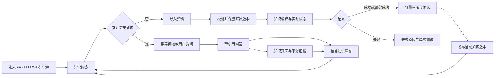

# FF - LLM Wiki知识库 MVP 产品功能与交互 Spec

## 1. 文档信息

| 项目 | 内容 |
|---|---|
| 文档名称 | FF - LLM Wiki知识库 MVP 产品功能与交互 Spec |
| 版本 | v0.3.16 |
| 状态 | Windows 个人版分阶段实施 |
| 上游需求 | `prd.md` v0.3.17 |
| 目标视口 | 桌面端 1440 × 900 |
| 创建日期 | 2026-08-04 |
| 最后更新 | 2026-10-03 |
| 评审人 | 项目发起人 |

### 1.1 变更记录

| 版本 | 日期 | 变更 |
|---|---|---|
| v0.3.16 | 2026-10-03 | F-04/F-05 引用和来源卡一键原文预览，按引用版本与位置自动滚动高亮，统一 Markdown、PDF 和 Word 的知识页来源阅读。 |
| v0.3.15 | 2026-10-02 | F-02 完整内容分组、真实批次和生成计数、失败后有效结果续跑；审核和发布仍等待完整校验。 |
| v0.3.14 | 2026-10-02 | 候选证据排序、停止与中断恢复；设置内完整项目备份、摘要校验与确认替换。 |
| v0.3.13 | 2026-10-02 | 全文分段、来源更新发布校验、引用失败重试、连续追问与知识/资料分页。 |
| v0.3.12 | 2026-09-28 | F-05 来源证据的原始资料在当前对话中预览，定位原文并保留关闭后的问答上下文。 |
| v0.3.11 | 2026-09-28 | F-05 问答消息逐条删除的确认、关联清理与生成中禁用状态。 |
| v0.3.10 | 2026-09-28 | 问答质量从资料管理移至独立一级导航；旧地址跳转到新页面。 |
| v0.3.9 | 2026-09-28 | F-08 获取后展示并保存全部模型；仅在问答框选择模型。 |
| v0.3.8 | 2026-09-28 | F-08 兼容服务允许 HTTP 并显示明文传输风险；DeepSeek 仍要求 HTTPS。 |
| v0.3.6 | 2026-09-28 | F-08 双在线配置与当前模型切换；本地模型仍不接入。 |
| v0.3.7 | 2026-09-28 | F-08 在线发现模型；F-05 每次问答的模型选择和重试保留。 |
| v0.3.5 | 2026-09-28 | 按用户决定移除旧 `.doc` 上传/转换入口；仅保留 DOCX 与文本/扫描 PDF。 |
| v0.3.4 | 2026-09-28 | 个人版首次空库和资料格式交互修订；企业 fixture 仅显式回归 |
| v0.3.3 | 2026-08-05 | 锁定问答消息方向与流式去重规则，并将首次进入的默认主题调整为深色；跟随系统和浅色仍可在设置中选择 |
| v0.3.2 | 2026-08-04 | 锁定真实产品语言：用户可见界面、内置来源、知识页面和引用内容统一使用正式业务措辞；内置快照改用 `KS-RETAIL-SERVICE-*` 标识，并将非真实业务结果纳入自动验收门槛 |
| v0.3.1 | 2026-08-04 | 锁定用户可见产品名 `FF - LLM Wiki知识库`、批准标志源文件、明暗主题使用规则和统一脚标 `@2026 赋范空间 独家自研` |
| v0.3.0 | 2026-08-04 | 接入已批准技术计划，锁定内置 Markdown 作为真实资料入库和可读来源；预置图谱经正式后端导入；DeepSeek 在线 API 真实实现，本地模型仅交付明确未接入的前端形态；其余 P0 链路全部真实开发与测试 |
| v0.2.3 | 2026-08-04 | 锁定开发期内置数据基线、默认知识快照及产品接入规则，明确 Codex 预编译数据与后续 DeepSeek 真实上传编译的同源关系 |
| v0.2.2 | 2026-08-04 | 增加 Codex 预编译内置知识快照契约：从同一批 Markdown 来源生成并保留完整证据，与 DeepSeek 真实上传编译共用对象契约和读取路径 |
| v0.2.1 | 2026-08-04 | 明确问答与图谱的源码复用基线和高完成度视觉效果要求，防止专业化、Apple 启发或双主题适配被误解为清淡化 |
| v0.2.0 | 2026-08-04 | 确认知识问答默认入口、固定侧边栏与五个一级模块；补充推荐问题、资料处理、Markdown 阅读、模型配置和设置契约 |
| v0.1.2 | 2026-08-04 | 增加专业产品命名约束，并把模板化、隐喻式界面名称统一为真实任务与业务对象名称 |
| v0.1.1 | 2026-08-04 | 增加全局明暗双主题、Apple 启发设计语言，以及图谱和 RAG 工作台的主题适配与验收约束 |
| v0.1.0 | 2026-08-04 | 根据 PRD、知识图谱、带来源引用的问答和编译式知识链形成第一版 Spec |

### 1.2 文档定位

本文把 PRD 中的 P0 核心旅程展开为可设计、可实现、可验收的产品形态、
功能模块、共享知识契约、状态转换和开发切片。

本文不重复技术框架、数据库和部署细节。已批准的实现方案由
`docs/architecture/0001-lmvk-mvp-technical-plan.md` 管理。
模板源码仍只作为可复用实现来源；其样例数据和非生产钩子不能进入正式产品。

### 1.3 本轮输入与使用边界

| 输入 | 本轮采用内容 | 不直接继承的内容 |
|---|---|---|
| `chatbot-frontend-templates-pack` | 优先复用 `assets/02-rag-citations.html`、`assets/shared.css` 和 `assets/shared.js` 的侧边栏、流式消息、引用聚焦、来源卡展开、过渡反馈与双主题共享层 | 模板账号、套餐、分享、无效模型选择器、样例回复和无真实逻辑的按钮 |
| `knowledge-graph-viz-pack` | 优先复用 `assets/02-bloom3d.html`、`assets/data.js` 和 `assets/shared.css` 的 3D 空间、节点光效、关系粒子、镜头聚焦、稳定布局和渲染验收底线 | 模板文案、样例节点、固定统计数字、硬编码样例数据和与已批准技术计划冲突的依赖决策 |
| `compiled-rag-pack` | 规则层、来源层、编译产物层的分离；来源不可变；知识互链；增量重编译；旧值防线 | GBrain、Skill 文件目录和定时调度器；这些实现不进入当前 MVP |

这些 Skill 约束产品逻辑和验收底线，不扩大 MVP 范围。

### 1.4 Windows 个人版交互修订（v0.3.5）

本节优先于下文与之冲突的 SD-17～19、预置快照首屏和仅文本 PDF 的旧版描述。首次启动及清空后的个人库没有来源、知识、图谱或推荐问题；问答、资料、知识页面和图谱展示明确空状态与“导入资料”入口，不以企业 fixture 填充。企业 fixture 仅供显式回归；首次个人资料发布前不得提问生成。资料管理接受 Markdown、`.docx`、文本型及扫描型 PDF，不提供旧 `.doc` 上传/转换；缺失本机 OCR 依赖需显示具体原因和重试入口，低质量 OCR 页标记待复核。来源详情和引用详情展示原文件版本以及可用的页码或段落和提取质量。M1 先验收 Markdown/文本 PDF，M2 再逐项验收 DOCX 与扫描 PDF 的完整流程。

## 2. 已确定的产品形态

### 2.1 产品形态判句

FF - LLM Wiki知识库是一个**知识问答优先的单项目 LLM Wiki 系统**：
用户进入系统后默认打开知识问答，通过固定侧边栏进入资料管理、知识页面、知识图谱和设置；
资料经真实编译后同时服务于推荐问题、带引用回答、Markdown 知识页面和知识图谱，
这些页面不是彼此失联的数据孤岛。

### 2.2 固定产品决策

| ID | 决策 |
|---|---|
| SD-01 | MVP 使用单项目、固定侧边栏和稳定主内容区；不建设通用管理后台式多级导航。 |
| SD-02 | 进入系统根入口时默认打开知识问答；没有可用知识时在问答空状态提供“导入资料”，不跳转到伪造结果。 |
| SD-03 | 知识图谱采用具有空间层次和明显但不过曝节点光效的 3D 可视化，适配数百节点级知识数据。 |
| SD-04 | 产品提供带来源引用的知识问答，引用可定位到知识与原始证据。 |
| SD-05 | 问答既能从图谱上下文发起，也能展开为完整问答工作区；返回图谱时恢复原焦点。 |
| SD-06 | 图谱、阅读器、来源、审核和问答只消费同一个已接受知识快照。 |
| SD-07 | 来源版本不可被编译过程改写；来源变化必须触发可见的待编译或重编译状态。 |
| SD-08 | P0 采用导入触发和人工重试的增量编译，不建设 cron、launchd 或无人值守调度。 |
| SD-09 | 所有用户可见工作区均继承明暗双主题；MVP 以 P0 全覆盖为硬门槛，后续 P1 模块不得退化为单主题。 |
| SD-10 | 产品采用 Apple 启发的简洁、克制、内容优先设计语言，但不复制 Apple 品牌素材或具体系统界面。 |
| SD-11 | 所有产品名称使用真实任务、业务对象、动作或可观察状态；模板名、隐喻名和模型术语不得直接成为界面名称。 |
| SD-12 | 一级模块固定为知识问答、资料管理、知识页面、知识图谱、问答质量和设置；其他能力归入页面内部。 |
| SD-13 | 设置真实支持 DeepSeek 与 OpenAI 兼容在线配置分别保存、连接测试和切换当前配置；本地模型只交付明确未接入的前端形态，不保存为运行配置、不调用后端、不验证连接。 |
| SD-14 | 推荐问题绑定当前已接受知识版本，点击后走正常问答流程，不允许绑定固定答案。 |
| SD-15 | 问答与图谱实现优先从项目内已选模板源码和共享层适配，不无理由从零重写；模板数据、文案和假逻辑不得进入产品。 |
| SD-16 | 专业命名、Apple 启发和双主题不等于清淡化；问答与图谱保留有业务意义的高完成度材质、光效、动效和空间效果。 |
| SD-17 | 允许 Codex 从仓库内不可变 Markdown 内置资料预编译首个知识快照；预置快照必须保留完整来源与证据身份、使用正式对象契约和产品读取路径，后续用户上传仍走 DeepSeek 真实编译。 |
| SD-18 | 开发期默认内置知识数据固定为 `enterprise-customer-service`，由 `preset/default.json` 解析到 `KS-RETAIL-SERVICE-1.1`；预置数据、知识页面、图谱和问答必须经正式数据接入边界读取，前端不得把图谱投影文件作为独立数据真相。 |
| SD-19 | 内置知识数据必须先通过正式后端接入层形成资料管理中的 66 个逻辑来源和 72 个可阅读 Markdown 来源版本，再导入同身份的知识快照与图谱投影。 |
| SD-20 | 除本地模型连接明确不在 MVP 实现范围外，P0 的上传、编译、审核、阅读、图谱和问答全部使用真实后端状态和数据并进入测试；不接受前端生成的业务结果、假进度或死按钮。 |
| SD-21 | 用户可见产品名固定为 `FF - LLM Wiki知识库`；`LlmWikiKnowledge` 只作为仓库目录和内部工程标识，不得以 `LMVK` 等旧名出现在产品界面。 |
| SD-22 | 产品标志固定使用 `docs/assets/brand/ff-llm-wiki-logo.png`，明暗主题均保持原始黑底白图；凡出现脚标、版权或研发署名，统一使用 `@2026 赋范空间 独家自研`。 |

### 2.3 固定侧边栏布局

目标视口下采用下列稳定结构。尺寸用于表达优先级，不是最终 CSS 常量。

```text
┌──────────────────────┬───────────────────────────────────────────────────────────────┐
│ 标志 / 完整产品名     │ 页面顶栏：页面名称 / 当前知识状态 / 全局搜索                 │
│                      ├───────────────────────────────────────────────────────────────┤
│ ＋ 新建对话           │                                                               │
│                      │                                                               │
│ 知识问答              │                       页面主内容区                            │
│ 资料管理  [处理状态]  │                                                               │
│ 知识页面              │  问答 / 资料与处理 / Markdown 阅读 / 图谱 / 设置             │
│ 知识图谱              │                                                               │
│                      │  节点、关系、来源和引用详情仅在相关页面按需打开               │
│ 最近对话              │                                                               │
│  · 对话标题           │                                                               │
│                      │                                                               │
│ 设置                  │                                                               │
└──────────────────────┴───────────────────────────────────────────────────────────────┘
```

- 侧边栏在目标桌面视口保持可见，可在窄桌面状态收起为图标，但一级入口和当前状态仍可识别。
- “新建对话”位于侧边栏顶部；设置固定在底部；最近对话只展示真实会话。
- 资料管理入口显示真实处理中或失败数量，不显示与后端状态无关的徽标。
- 页面不使用永久第三栏；来源、引用、节点和关系详情根据任务在右侧按需打开。

### 2.4 工作区模式

| 模式 | 进入条件 | 页面主内容区 | 按需详情 | 退出后恢复 |
|---|---|---|---|---|
| `qa` | 进入系统根入口、新建或打开对话 | 推荐问题、输入区、对话和回答 | 引用、采用来源和命中原文 | 当前会话、草稿、滚动和引用位置 |
| `sources` | 用户导入、管理或查看资料 | 已入库资料、处理任务、处理记录 | 当前来源或任务详情 | 当前页内视图、筛选和选择 |
| `compile` | 资料管理中的处理任务运行或查看摘要 | 真实阶段、计数和结果确认 | 失败或警告详情 | 返回资料管理原位置 |
| `source-preview` | 从资料或引用打开原始来源 | 在线阅读和引用定位 | 文件版本与处理信息 | 原资料、知识或回答位置 |
| `knowledge` | 从侧边栏、图谱、引用或目录打开知识 | 知识目录与 Markdown 正文 | 页面目录、关系和来源 | 原图谱焦点或原回答位置 |
| `graph` | 存在已接受知识快照 | 知识图谱 | 节点、关系或关联证据 | 当前相机、筛选和选择 |
| `quality` | 用户从侧边栏打开问答质量 | 真实回答、失败记录和未评估的质量维度 | 回答、引用与核查详情 | 原对话、来源或知识页面 |
| `settings` | 用户选择侧边栏底部设置 | 模型配置和外观偏好 | 连接测试结果 | 原设置分区与未丢失的安全表单状态 |

一级模块切换不得重置后台任务、图谱相机、当前筛选、选中对象、问答草稿或阅读位置。
进入系统根入口默认 `qa`；刷新明确页面路由时恢复该页面和真实状态。

### 2.5 Apple 启发的视觉系统

“Apple 风格”在本项目中被定义为下列可执行原则，而不是笼统的“像 Apple”：

1. **内容优先**：知识、证据和当前任务是视觉中心；装饰不能抢占信息层级。
2. **清晰层级**：每个工作区最多一个主要动作；标题、正文、辅助信息和状态有稳定层级。
3. **克制留白**：使用一致的间距节奏和宽松阅读密度，不做卡片堆叠式通用后台。
4. **精细材质**：基础面、内容面和浮层面有明确层级；细边框、柔和阴影和半透明只用于解释层级。
5. **系统化字体**：优先使用适合当前平台和中文阅读的系统字体栈；数字、版本和时间使用等宽字体。
6. **克制圆角**：圆角服务于容器层级和触控反馈，不把所有文字、标签和按钮都做成胶囊。
7. **轻量动效**：转场用于解释聚焦、展开和返回；除用户主动开启的图谱自动浏览外，不使用持续装饰动画。
8. **精确控件**：图标、文字和点击区域必须表达真实动作；没有真实逻辑的控制不进入正式产品。

上述原则约束的是层级、可读性和产品语言，不是要求视觉清淡化。
问答中的流式反馈、引用聚焦、来源卡展开和材质过渡，以及图谱中的 3D 空间、节点光效、
关系流动和镜头聚焦，均属于核心产品表现，不得为了“简洁”被删除。

禁止直接使用 Apple 标志、产品截图、品牌命名或逐像素复刻系统组件。

### 2.6 全局主题状态契约

- 设置中的 `themePreference` 支持 `system`、`light`、`dark`；`resolvedTheme` 只能是 `light` 或 `dark`。
- 首次进入默认使用深色主题；用户手动选择浅色、深色或跟随系统后持久保存，后续进入优先使用该偏好。
- 首屏在内容出现前解析主题，不能先闪出错误主题再切换。
- 明暗主题分别设计，不使用全页面反色滤镜，也不把深色 token 机械取反得到浅色 token。
- 背景、内容面、浮层、文字、边框、强调、成功、警告、错误、焦点和骨架屏全部使用语义 token。
- 透明和模糊效果不可用时，必须降级为可读的不透明内容面。
- 主题切换只改变表现，不重置后台任务、工作区、图谱布局、选择、筛选、阅读位置或问答状态。
- 状态和关系不能只靠颜色表达；两套主题都保留文字、图标、边框或形状辅助。

### 2.7 产品语言与命名契约

- 界面名称必须直接说明真实业务对象、可执行动作或可观察状态；用户不需要理解实现方式或猜测隐喻。
- 导航、模块、面板、按钮、字段、状态、提示，以及图谱节点和关系类型使用同一套稳定业务词汇。
- 正常界面优先使用“资料”“知识”“知识图谱”“来源”“引用”“审核”“知识问答”等直接名称。
- 模板方案名、展厅标签和技术实现词只能作为内部来源记录，不能进入产品导航、标题、控件或状态文案。
- `RAG`、`snapshot`、`token`、`embedding` 等词只在技术文档、诊断信息或面向技术角色的场景使用；普通界面改写为用户可理解的任务语言。
- 禁止使用“驾驶舱”“XX 舱”“星空”“深空”“宇宙”“中枢”“大脑”“魔法”等包装普通功能。
- 同一概念只能有一个产品名称；名称调整时同步其 PRD、Spec、界面、数据契约说明和验收证据。

### 2.8 品牌名称、标志与署名契约

- 所有用户可见文字产品名使用 `FF - LLM Wiki知识库`，保持英文大小写、连字符两侧空格，
  且 `Wiki` 与“知识库”之间不加空格。
- 展开侧边栏显示批准标志和完整产品名；收起侧边栏可以只显示标志，但必须提供
  `FF - LLM Wiki知识库 Logo` 无障碍文本。
- 浏览器标题、首次加载、错误恢复和关于信息不得显示 `LMVK` 或 `LlmWikiKnowledge`。
- 标志源文件为 `docs/assets/brand/ff-llm-wiki-logo.png`。保持 1:1 比例、黑色方形画布和白色图形，
  不裁切、拉伸、反色、重绘或增加装饰特效。
- 浅色和深色主题使用同一标志；只允许通过外层留白或克制边界保证辨识度，不能修改位图。
- 凡实际存在脚标、版权、关于署名、导出署名或产品署名，文案逐字使用
  `@2026 赋范空间 独家自研`；不要求在每个业务页面强行增加常驻页脚。
- 完整使用与验收细节由 `docs/design/brand.md` 管理。

## 3. P0 核心旅程



### 3.1 旅程连续性

- 从问答空状态进入资料管理并完成编译后，返回同一问答上下文并刷新可用知识状态。
- 从图谱进入知识页面时，记录图谱相机、筛选和选中对象。
- 从知识或回答打开来源时，记录原知识段落或回答引用位置。
- 从图谱发起问题时，问题携带当前节点或关系作为显式上下文，界面必须展示该上下文。
- 从回答打开相关节点时，回到同一图谱快照并聚焦真实节点，不生成临时假节点。
- 侧边栏切换不终止编译任务，不清空对话草稿，也不丢失知识页面阅读位置。
- 失败后恢复以单项重试为主，不要求用户重建项目或刷新页面修复状态。

## 4. 功能模块与范围

### 4.1 模块清单

| 模块 ID | 模块 | 呈现方式 | 优先级 | 核心能力 | PRD 追踪 |
|---|---|---|:--:|---|---|
| UI-M01 | 系统主界面与固定侧边栏 | 全局框架 | P0 | 六个一级入口、新建对话、最近对话、处理状态、全局恢复 | AC-UI-02, AC-JOURNEY-01 |
| UI-M07 | 知识问答 | 一级模块、默认入口 | P0 | 推荐问题、对话历史、检索状态、带引用答案、来源和图谱联动 | F-05, AC-F05-01～04 |
| UI-M02 | 资料管理 | 一级模块 | P0 | 批量导入、入库文件、在线查看、处理任务、处理记录和重试 | F-01, AC-F01-01～03 |
| UI-M06 | 知识页面与来源阅读 | 一级模块 | P0 | 知识目录、Markdown 正文、关系上下文、原文定位和往返 | F-04, AC-F04-01～02 |
| UI-M04 | 知识图谱 | 一级模块 | P0 | 全景、聚焦、搜索、筛选、节点和关系探索 | F-03, AC-F03-01～04 |
| UI-M08 | 问答质量 | 一级模块 | P1 | 真实回答与失败记录、引用核对和持久化人工核查 | F-06, AC-F06-02 |
| UI-M09 | 设置 | 一级模块 | P0 | 两条在线配置的真实连接测试和切换、本地模型未接入状态及外观偏好 | F-08, AC-F08-01～02 |
| UI-M03 | 编译与轻审核 | 资料管理页内能力 | P0 | 可见编译阶段、结果摘要、接受、待处理、失败重试 | F-02, AC-F02-01～04 |
| UI-M05 | 详情区域 | 跨页面按需能力 | P0 | 节点、关系、来源、引用和处理问题详情 | F-03～05 |

一级模块严格限定为 UI-M07、UI-M02、UI-M06、UI-M04、UI-M08 和 UI-M09 六个。
UI-M01 是全局框架；UI-M03 和 UI-M05 不占用独立一级导航。F-07 数据控制属于设置页内能力。

### 4.2 问答模板保留与删除

| 处理 | 内容 |
|---|---|
| 直接复用 | `assets/02-rag-citations.html` 的对话、引用和来源结构；`assets/shared.css` 的双主题 token 与骨架；`assets/shared.js` 的流式渲染和消息工厂。实现时允许模块化拆分，但不得无理由重写成熟交互。 |
| 保留效果 | 流式回答、光标反馈、引用角标悬停与聚焦、来源卡定位/高亮/展开、未采用来源折叠、面板过渡、按钮即时反馈和证据不足提示。 |
| 适配 | 问答成为系统默认入口；推荐问题来自当前知识版本；会话仅属于当前项目；来源卡改为项目真实来源；模板示例回复钩子替换为真实问答服务；视觉纳入系统共享 token。 |
| 删除 | 模板库面包屑、PRO 套餐、账号装饰、分享、无效知识空间选择器、固定模型标签和样例数据 |
| P0 操作 | 新建对话、切换最近对话、选择推荐问题、发送、重试失败请求、复制答案、打开引用、进入知识页面或图谱 |
| 暂不做 | 点赞点踩、公开分享、导出带引用报告、多模型切换和跨项目会话搜索 |

所有保留按钮必须连接真实逻辑。暂不做的操作不显示，不能用 toast 伪装成已实现。

### 4.3 知识图谱模板保留与扩展

| 处理 | 内容 |
|---|---|
| 直接复用 | `assets/02-bloom3d.html` 的 3D 场景、镜头聚焦、节点光效和关系粒子实现；`assets/data.js` 的单一图谱数据入口；`assets/shared.css` 的视觉基础。产品实现使用技术计划锁定的 `react-force-graph-3d` 与 Three.js。 |
| 保留效果 | 3D 空间层次、克制但明显的节点外围光效、语义分簇、节点大小层级、沿关系流动的粒子、镜头移向选中节点、稳定布局和图例。 |
| 适配 | 节点和边来自当前知识快照；领域颜色来自项目语义；统计数字实时计算；模板文案全部改为产品语言；`window.KG` 或其等价适配层由真实 `GraphProjection` 生成。 |
| 补齐 | 搜索、筛选、重置视角、节点悬停、节点选择、关系选择、证据详情面板、空态、部分态和错误恢复 |
| 删除 | 模板返回按钮、展品编号、固定 120 节点文案、样例 AI 领域数据和与业务无关的展示术语 |

本节只定义视觉和交互方向，不形成对外产品名称。
图谱渲染库和数据入口已由技术计划锁定；节点光效、布局和两套主题参数在实现与视觉验收中调校。

### 4.4 双主题覆盖矩阵

| 区域 | 浅色主题要求 | 深色主题要求 | 两套共同要求 |
|---|---|---|---|
| 主界面、侧边栏、资料、编译和设置 | 明亮中性底、清晰分隔、轻阴影 | 深灰层级、克制边框、避免纯黑糊成一片 | 默认、悬停、聚焦、禁用、加载、成功、警告和错误状态完整 |
| 知识图谱 | 有层次的浅色画布、清晰节点核心、可见但受控的光效、增强边和标签轮廓 | 深色画布、明显但不过曝的节点光效、低噪关系层、关系粒子和清晰高亮 | 同一领域语义、同一布局、选择与效果能力；分别校验配色和过曝情况 |
| 阅读器与来源预览 | 纸面感内容区、清晰引文高亮 | 深色阅读面、降低大面积高亮亮度 | 长文可读、引用位置明确、切换主题不改变阅读位置 |
| 知识问答 | 精细内容面、流式反馈、引用聚焦、来源卡高亮与展开过渡 | 分层深灰材质、流式反馈、引用聚焦、来源卡高亮与展开过渡 | 输入、消息、引用、来源卡、原文高亮、骨架和错误态全部适配，不得退化为静态消息列表 |
| 浮层与详情面板 | 半透明效果下仍有足够边界 | 与画布分层但不形成厚重黑块 | 模糊不可用时可读降级；键盘焦点清晰 |

主题偏好只在设置中维护一份，全局生效，不在每个模块重复实现。
本矩阵适用于 UI-M01～UI-M09；尚未进入 MVP 的 P1 能力在后续实现时也必须继承同一主题契约。

## 5. 共享知识对象与身份契约

### 5.1 核心对象

| 对象 | 必要身份与字段 | 主要消费者 |
|---|---|---|
| `Project` | `projectId`、名称、当前接受的 `snapshotId` | 全部模块 |
| `Source` | `sourceId`、文件元信息、当前版本、导入状态 | 资料、编译、来源预览 |
| `SourceVersion` | `sourceVersionId`、内容摘要、版本时间、只读内容引用 | 编译、引用、旧值判断 |
| `EvidenceFragment` | `evidenceId`、`sourceVersionId`、页码或字符范围、原文片段 | 知识、关系、问答引用 |
| `CompileRun` | `runId`、输入来源版本、阶段、计数、警告、错误 | 资料管理、问题检查 |
| `KnowledgeItem` | `knowledgeId`、稳定标题、类型、正文、摘要、审核状态、来源引用 | 图谱节点、阅读器、检索 |
| `Relation` | `relationId`、两端 `knowledgeId`、类型、方向、权重、证据引用 | 图谱边、关系详情、问答 |
| `KnowledgeSnapshot` | `snapshotId`、接受时间、对象版本集合、索引状态 | 图谱、阅读器、问答 |
| `Conversation` | `conversationId`、所属项目、问题序列、当前上下文 | 问答工作区 |
| `Answer` | `answerId`、`snapshotId`、状态、正文、引用、相关知识 ID | 问答、图谱、来源预览 |
| `SuggestedQuestion` | `questionId`、`snapshotId`、问题文本、相关知识 ID、生成时间 | 问答空状态 |
| `ModelProfile` | `profileId`、在线配置显示名称、服务地址、可用模型列表及默认模型、凭据引用、测试状态 | 设置、编译、问答 |
| `AppPreference` | 主题偏好、减少动态效果、默认模型配置 ID | 设置、全部一级模块 |
| `ReviewIssue` | `issueId`、对象 ID、类别、严重度、恢复动作 | 编译摘要、问题检查 |

### 5.2 身份一致性规则

1. 图谱节点不是独立业务对象，只是 `KnowledgeItem` 的可视化投影。
2. 图谱边不是视觉线条记录，只是 `Relation` 的可视化投影。
3. 阅读器路由、图谱节点和问答相关知识必须使用同一个 `knowledgeId`。
4. 关系详情和问答引用必须使用同一个 `evidenceId` 回到原始来源位置。
5. 图谱、阅读器和问答响应都携带 `snapshotId`；一个界面状态中不得混用不同快照。
6. 稳定知识 ID 不因重新布局或标题微调而改变；删除或合并必须产生显式迁移结果。
7. 可视化适配层可以生成 `degree`、领域分组和布局种子，但不能成为新的持久化知识真相。
8. 推荐问题必须携带当前 `snapshotId`；知识版本变化后，旧推荐问题不得继续作为当前推荐展示。
9. `ModelProfile` 只表示可运行的 DeepSeek 或 OpenAI 兼容在线配置并保存独立凭据引用，不把明文凭据写入页面状态、日志、导出包或普通业务响应；本地模型展示表单不创建 `ModelProfile`。
10. 更换默认模型只影响随后创建的编译任务和问答，不修改已发布知识或历史回答的模型事实。

### 5.3 图谱投影契约

图谱视图至少消费：

- `snapshotId`；
- `domains`：展示分组、名称和颜色 token，展示层最多 8 组，长尾可归入“其他”；
- `nodes`：`knowledgeId`、名称、类型、领域、度数、来源数、审核状态；
- `edges`：`relationId`、两端 `knowledgeId`、关系类型、方向、权重、证据数、审核状态；
- `layoutSeed`：同一快照重复进入时保持可复现的初始布局；
- 节点和边总数，用于与已接受编译结果对账。

领域合并只改变图例分组，不得改写知识类型或关系语义。
关系没有明确方向时，不使用暗示方向的数据粒子。

## 6. 编译式知识链路

### 6.1 三层逻辑边界

| 层 | 所有权 | 产品规则 |
|---|---|---|
| 规则层 | 项目约定 | 定义知识类型、命名、关系和引用要求；后续落在哪种配置中由技术方案决定。 |
| 来源层 | 用户 | 保留原始来源版本，编译只能读取，不能静默改写。 |
| 产物层 | 系统 | 生成可读知识、关系、引用和派生索引；可重建、可审核、可追踪到来源。 |

物理目录、数据库表或对象存储结构不在本 Spec 中决定。

### 6.2 单次编译流程

| 阶段 | 可见状态 | 输入 | 输出 | 失败恢复 |
|---|---|---|---|---|
| 1. 校验 | 正在校验 | 待导入文件 | 可处理项、重复或格式问题 | 移除、重新选择 |
| 2. 来源入库 | 正在导入 | 通过校验的文件 | 不可变 `SourceVersion` | 单项重试 |
| 3. 内容提取 | 正在读取 | 来源版本 | 可编译文本和定位信息 | 标记失败，不阻塞其他项 |
| 4. 知识重组 | 正在生成知识 | 多个来源片段、规则层 | 跨来源 `KnowledgeItem` | 保留成功项和问题摘要 |
| 5. 关系与引用 | 正在建立关系 | 知识、证据 | `Relation`、`EvidenceFragment` 引用 | 缺证据关系进入警告 |
| 6. 一致性校验 | 正在校验结果 | 知识、关系、引用 | 悬空边、缺来源、冲突清单 | 返回问题对象修复或重试 |
| 7. 轻量审核 | 等待确认 | 编译候选结果 | 接受项、待处理项 | 用户接受可用结果或保留待处理 |
| 8. 原子发布 | 正在发布 | 已接受结果 | 新 `KnowledgeSnapshot` 及派生索引 | 失败时继续保留上个快照 |

进度必须来自真实阶段和真实计数，不使用定时器伪造百分比。

### 6.3 编译产物验收线

- 知识按概念、系统、争议、实体等知识单元重组，不与来源文件强制 1:1 对应。
- 每个知识项必须有摘要、正文、稳定身份、类型和至少一个来源引用；证据不足时不得伪装为确定知识。
- 每条已确认关系必须有明确语义；需要来源支持的关系必须能打开证据。
- 不允许悬空节点引用、悬空关系端点和失效引用被静默接受。
- 编译摘要必须给出新增、更新、保留、警告和失败数量。
- 内置资料也必须通过同一流程生成这些产物，不能直接写入图谱或答案结果。
- 所有可编译非空正文必须进入可追溯的证据分段，短段落、长段落尾部及超过单次生成容量的正文不得静默遗漏；分段不得跨原文件页码或内容块。
- 生成输入与引用证据分层：尽量按标题、完整问题及解释组织输入，细粒度原文证据及定位保留；无法在处理限制内完整容纳的内容分段保留所属标题，不丢弃短段落。
- 多批生成须完整结束后才提供审核候选；同名知识去重正文及证据，存在专题冲突时停止并保留原因，不猜测不同名称是否同义。进度计数来自实际完成批次及候选数量，进度条只表示生成批次完成比例，不表示模型内部进度或发布完成度。
- 成功批次保留可恢复结果；失败或中断后的重新处理只复用与当前资料、专题、在线服务及基础知识版本一致的结果。资料或配置变化时重新生成；任何未完成结果均不可审核发布。

### 6.4 来源变化与“答旧值”防线

1. 用户替换或重新导入来源时创建新 `SourceVersion`，旧版本保留为既有引用的证据。
2. 受影响对象立即进入 `update_pending`，顶栏、图谱和问答显示“知识更新待编译”。
3. 重编译进行中，上一个已接受快照仍可浏览，但必须标明“基于上次已完成编译”和快照时间。
4. 新编译结果只有在一致性校验和接受完成后才原子发布。
5. 发布时图谱投影、阅读器、检索索引和问答默认快照一起切换，不能各自切换。
6. 编译失败时保留上一个可用快照，同时显示失败来源和重试入口。
7. 新快照发布后，新问题不得再命中旧快照；历史答案继续显示其原 `snapshotId` 和“历史结果”标识。
8. 重新处理变化来源时，一并处理共同支持受影响知识的其他当前来源；用重新生成的知识及关系替换受影响旧产物，不再生成的受影响页退出当前版本，未受影响页及历史来源、证据、快照保留。
9. 接受前再次校验输入来源版本及编译所基于的知识版本；任一变化则拒绝发布、保存失败原因，并允许基于当前来源重新处理。

### 6.5 增量范围

- 首次编译允许全量处理当前项目来源。
- 后续导入或来源变化时，只重新处理变化来源及受影响知识和关系；具体增量算法由技术方案决定。
- P0 提供导入后自动开始、人工重新编译和单项失败重试。
- P0 不提供目录监听、定时抓取和无人值守调度。
- 编译执行时记录实际使用的在线配置身份；当前配置不可用时不得伪装启动，
  必须说明当前模型未就绪或真实连接错误并提供进入设置的操作。

## 7. 模块行为规格

### 7.1 UI-M01 系统主界面与固定侧边栏

**固定结构**：侧边栏顶部展示批准标志、完整产品名“FF - LLM Wiki知识库”、当前知识库和“新建对话”；
一级导航依次为知识问答、资料管理、知识页面、知识图谱；最近对话位于导航下方；设置固定在底部。

**默认入口**：进入系统根入口时激活知识问答。刷新具体页面路由时恢复该页面，
不能为了默认入口强制打断用户正在进行的任务。

**页面顶栏**：展示当前页面名称、当前知识状态和全局搜索。
模型选择与主题偏好属于设置，不在顶栏制造重复控件。

**处理中状态**：资料管理入口展示真实处理中或失败数量；用户可以继续使用上一个已接受知识版本。

**恢复规则**：刷新或重新进入项目后，从持久状态恢复真实任务、当前一级模块、
图谱选择、对话草稿、阅读位置和失败信息，不得回到假初始态。

### 7.2 UI-M02 资料管理

- 支持拖放或选择多个 Markdown、纯文本和可提取文本的 PDF。
- 选择后先展示文件名、格式、大小、重复提示和可读性校验，再由用户确认导入。
- 每项独立显示等待、校验、读取、编译、成功、部分成功或失败。
- 批次中单项失败不阻塞其他项。
- 页面内部提供“已入库资料”“处理任务”“处理记录”三个页内视图。
- 已入库资料以列表展示文件名、类型、版本、处理状态、更新时间、生成知识数和可执行操作。
- 资料列表提供当前页、总数及前后翻页，搜索变化重置第一页；页码越界时回到有效页，读取中及首尾页禁用不可用操作。列表翻页不占用 PDF 物理页码的定位参数。
- 来源详情展示版本、导入时间、支持的知识数和最近编译结果。
- 用户可以在线查看 Markdown、纯文本和 PDF 可提取内容；预览保持来源只读。
- Markdown 来源使用与知识页面一致的安全阅读能力；PDF 引用定位范围继续受 OQ-07 约束。
- 重试只处理失败项；移出来源需二次确认，说明当前混合来源知识页会整体移除，历史快照、证据和原件仍可访问。成功后同步刷新当前知识、关系、图谱、检索和来源计数；有进行中任务时提示先取消。

### 7.3 UI-M03 编译与轻审核（资料管理页内）

- 处理任务页运行中实时展示当前阶段、已处理来源数、知识数、关系数、警告和失败。
- 进行中任务可二次确认取消并停止后台处理；已结束任务可二次确认删除任务和事件记录，不回滚已发布知识。操作失败保留确认状态并显示原因。
- 侧边栏切换不终止任务；返回或刷新后从真实任务状态恢复。
- 结束后优先展示新增知识、更新知识、新关系、冲突、警告和失败。
- 用户可接受可用结果；有问题的对象可保持待处理，不要求进入复杂审批流。
- P0 不提供知识正文编辑器；编辑、接受/拒绝边界继续由 OQ-06 决定。
- 失败卡必须包含对象、原因和可执行重试入口，不能只显示通用“处理失败”。
- 接受前展示即将发布的新知识版本范围；接受完成后主要操作为“返回知识问答”，
  同时提供“查看知识页面”和“查看知识图谱”。

### 7.4 UI-M04 知识图谱

#### 7.4.1 视觉规则

- 明暗主题下图谱都是独立一级模块中的主要视觉内容，固定侧边栏和文字层保持克制、清晰。
- 节点颜色表示稳定的领域或类型；颜色不表示排名、置信度或审核结果。
- 节点尺寸来自真实图度数或明确业务权重；不得为视觉效果随机放大。
- 边宽、亮度和流动效果必须有可解释字段来源。
- 节点外围光效用于建立层级并形成视觉辨识度，必须明显可见，但不能让节点核心、标签或边界过曝发虚。
- 关系粒子只沿真实关系运行，数量或速度来自明确权重规则；无方向关系不得用粒子暗示方向。
- 点击节点后的镜头移动必须保留，时长足以解释空间聚焦但不阻塞用户继续操作。
- 标签默认优先显示枢纽、悬停、选中和搜索命中项，避免全量标签堆叠。没有枢纽的稀疏图按真实连接数择优显示少量节点名称，不标记为枢纽、不补造关系；聚焦时优先显示选中节点及其直接邻接名称。
- 图例始终可到达；状态和关系类型不能只靠颜色表达。

#### 7.4.2 明暗主题适配

**深色主题**：

- 使用深色画布、明显但不过曝的节点光效和低噪关系层建立清晰聚焦。
- 节点必须保留清晰实体核心；发光只做外围层级，不得覆盖标签、边界和选择状态。
- 未选边保持低存在感，悬停、选中和搜索命中再提升亮度或宽度。

**浅色主题**：

- 使用有空间层次的明亮中性画布，不把深色画布直接嵌进浅色工作台，也不使用反色滤镜。
- 节点使用更清晰的实体核心、细描边和可见但受控的光效；关系边和粒子提高轮廓清晰度，避免消失在浅色底上。
- 标签和 tooltip 使用可读内容面承载，不能依赖白色发光文字浮在亮底上。
- 浅色主题单独调整节点光效、阴影、边透明度和标签对比，不复用深色参数冒充适配。

**切换规则**：

- 同一领域在两套主题中保持同一语义身份，允许使用分别校验过的主题色值。
- 主题切换不得重新计算知识布局或改变节点位置、相机、筛选、选择和详情面板内容。
- 两套主题分别完成颜色机检、渲染截图和交互点验；任一主题白屏、过曝、发虚或图例失配均不通过。

#### 7.4.3 交互规则

- 初次进入展示稳定全景；可选自动浏览在用户第一次操作后立即停止。
- 支持旋转、缩放、平移、搜索、类型筛选、审核状态筛选和重置视角。
- 悬停节点时突出直接邻接关系并弱化无关内容。
- 选择节点时相机平滑聚焦，右侧详情面板打开真实知识摘要和来源入口；已选节点及直接邻接保持聚焦，不被路过其他节点的悬停覆盖，直到关闭详情或主动选择其他对象。
- 选择关系时突出两端节点，详情面板展示关系语义、方向、审核状态和支持证据；两端高亮不被节点悬停覆盖。
- 从回答进入图谱时聚焦 `relatedKnowledgeIds`，并保留返回回答位置的入口。
- 用户开启减少动态效果时，关闭自动浏览、粒子流和非必要相机动画，所有功能仍可用。

#### 7.4.4 状态规则

| 状态 | 画布行为 |
|---|---|
| 加载 | 显示稳定骨架与真实加载说明，不播放假图谱动画。 |
| 空 | 显示导入或编译入口，不创建占位节点。 |
| 部分成功 | 展示已接受对象，并明确缺失来源或警告数量。 |
| 全景 | 展示当前快照全部可见节点、边、图例和计数。 |
| 聚焦 | 选中对象和直接邻接清晰，其他对象降噪但仍保留空间上下文。 |
| 错误 | 保留主界面，显示渲染错误与重试；提供可进入知识目录的恢复路径。 |

### 7.5 UI-M05 / UI-M06 详情区域、知识页面与来源阅读

**节点详情**：标题、类型、审核状态、摘要、来源数、直接关系、打开知识和围绕此节点提问。

**关系详情**：关系两端、关系类型、方向、说明、证据数、审核状态和打开证据。

**知识目录**：提供知识搜索、类型筛选、状态筛选、标题、更新时间和来源数量；
打开页面不创建另一套知识身份。
搜索覆盖标题、摘要及正文；分页展示全部命中知识及总数。搜索、专题筛选和页码以地址状态同步，
查询变化回到第一页并清除旧阅读选择，顶栏与目录提交搜索后展示同一查询及对应正文。

**Markdown 阅读器**：展示标题、页面目录、结构化正文、知识状态、关系上下文、来源引用和更新时间；
支持标题、段落、列表、表格、代码块、引用、链接、图片和页内锚点等常用 Markdown 语义。

**安全规则**：导入或编译产生的 Markdown 被视为不可信内容；脚本、事件处理器、危险 URL
和其他主动内容不得执行。具体渲染与清理组件由技术方案决定。

**来源预览**：点击知识页引用直接打开对应来源版本，按字符范围自动滚动并高亮命中原文，保留前后文；Markdown 保持格式，PDF 和 Word 按提取的页或段落显示。字符范围无法定位时使用引用页或段落定位，不伪造高亮。读取中、错误及重试可见；来源不可访问或读取失败时保留引用记录和已有证据上下文。

**往返规则**：

- 图谱 → 知识 → 来源 → 图谱，恢复原节点、相机和筛选；
- 回答 → 引用 → 来源 → 回答，恢复原回答和引用位置；
- 知识 → 相关关系 → 图谱，聚焦真实关系两端。

### 7.6 UI-M07 知识问答（默认入口）

#### 7.6.1 产品形态

进入系统根入口时默认显示知识问答，也可以通过“新建对话”、最近对话、
知识页面或当前节点的“围绕此知识提问”进入。
固定侧边栏承载最近对话，页面主内容区承载推荐问题、问题输入和回答；
来源、引用和命中原文在右侧按需打开。
问答不是独立数据孤岛，界面始终显示当前知识版本和可选图谱上下文。

**新对话与推荐问题**：

- 存在已接受知识版本时，新对话展示 3～4 个来自该版本的推荐问题。
- 推荐问题必须关联 `snapshotId` 和相关知识 ID；知识版本变化后重新生成或失效。
- 点击推荐问题等同于提交普通用户问题，必须经过检索、证据整理、回答和引用校验。
- 没有可用知识时，只展示清晰说明、问题输入的禁用原因和“导入资料”操作，
  不展示无法回答的问题或固定答案。
- 最近对话只展示当前项目真实会话；P0 支持新建和切换，不加入公开分享或跨项目搜索。

#### 7.6.2 明暗主题适配

- 知识问答沿用内容优先的产品视觉，同时保留选定模板中的精细材质、流式反馈、引用聚焦、
  来源卡高亮/展开和面板过渡，不得改成普通白底文本框与静态消息列表。
- 浅色主题使用明亮中性内容面、细分隔和轻阴影，保证长回答、引文和来源卡接近稳定阅读体验。
- 深色主题使用分层深灰而非纯黑，主文字、次要文字、边框和消息层分别调校，不做浅色主题机械反转。
- 引用角标、采用来源卡、未采用来源、命中原文高亮、证据不足、骨架屏和错误态都必须有两套 token。
- 引用采用、相关性和证据状态除颜色外，同时使用文字、图标或边框表达。
- 点击引用时来源卡平滑定位并短时高亮；展开命中原文和未采用来源时使用清晰过渡，
  动效只解释状态变化，不阻碍阅读。
- 切换主题时保留当前会话、输入草稿、滚动位置、已展开来源卡、当前引用高亮和图谱上下文。
- 主题切换后的按钮文案或图标必须准确表达下一步动作，不能让当前态与目标态含义混淆。

#### 7.6.3 提问与回答流程

输入区下方提供在线模型选择。默认使用当前已验证配置，切换只作用于本次及后续本页问答，不改变编译默认配置；已提交回答和失败重试保留当次所选服务及模型。模型列表无法在线获取时仍可使用服务设置中已经验证的模型。

1. 用户提交问题后立即创建消息，并显示“已接收”；用户问题右对齐，知识回答左对齐。
   提交中的临时问题与后端已保存消息按本次提交合并，整个流式阶段同一问题只能显示一次。
2. 状态依次进入检索知识、整理证据、生成回答；只展示真实阶段。
3. 检索只使用当前已接受知识版本；存在待编译来源时显示持续警告。
4. 回答关键结论使用可点击引用角标，不在纯 HTML 文本中伪造引用。
5. 来源面板区分“回答采用”和“检索到但未采用”，后者默认折叠。
6. 点击正文引用角标、回答底部引用或来源卡时选中对应来源卡，并直接在当前对话打开只读资料预览，按引用版本和字符范围自动滚动高亮原文，保留前后文；同一资料的不同引用须重新定位各自位置。“查看来源”仅打开来源列表，来源卡的“查看原始资料”仍可打开预览。读取中、失败及重试均在预览中处理。关闭预览后保留当前回答、已展开的来源卡和阅读位置，不跳转资料管理页。PDF 和 Word 可从预览另行打开原件。
7. 回答展示相关知识和关系入口，点击后返回同一快照的图谱上下文。
8. 证据不足时返回明确的不足说明和已检索范围，不生成确定性结论或虚假来源。
9. 每条已保存消息提供删除入口。删回答保留原问题；删问题同时移除该问题关联的回答、事件及质量审核。删除需二次确认，失败保留确认框和错误信息，成功后刷新对话与质量统计；流式生成和临时消息的删除入口禁用。
10. 侧栏“最近提问”的每条记录提供删除入口，标题仍可进入对话。确认后删除该对话下的消息、回答事件及质量审核，刷新最近提问与质量统计；删除当前对话则返回问答首页。回答生成中拒绝删除并在确认框说明原因，操作不影响资料及已发布知识。

#### 7.6.4 回答展示契约

- 回答头部显示采用来源数、检索来源数和知识快照时间。
- 每个引用至少关联 `evidenceId`、`knowledgeId` 和来源标题。
- 流式阶段可以逐步显示正文，但未完整接收的引用不得成为可点击的错误链接。
- 回答完成前校验引用编号：必须至少有一个引用且全部位于本次有序证据范围内；缺失、零编号或越界编号使整条回答进入失败状态，保留问题、明确原因并提供重试，不保存为成功正文。
- 编号有效只证明可回到证据，不代表已验证每条结论的事实正确性。
- 连续追问使用有界近期用户问题帮助理解指代；所选知识必须在本次回答使用的已接受快照中仍存在。历史问题仅供上下文解释，历史回答不作为证据，新回答仍仅依据本次检索和所选知识的原始证据。
- 不展示无法解释的总置信度百分比；使用“证据充分、证据有限、无法确认”三种证据状态。
- 历史答案保留原快照标识；知识更新后不静默重写历史回答。
- 对全部候选片段按当前问题和上一条问题的低权重上下文排序，再选取最多 12 段；保留来源定位和去重语义，不声明语义检索或事实核验已完成。
- 生成中显示停止按钮；停止和服务重启均保存明确失败记录及手动重试入口。刷新对话会重新连接活跃回答或显示已保存失败，不自动发起模型请求，同一对话拒绝并行生成。

#### 7.6.5 问答状态

| 状态 | 用户可见行为 | 恢复 |
|---|---|---|
| 空 | 推荐问题只来自当前真实知识版本；没有知识时显示导入资料操作。 | 进入资料管理后返回同一新对话 |
| 已接收 | 立即回显用户问题。 | 不重复提交 |
| 检索中 | 展示真实检索阶段和当前上下文。 | 保持问题可见；失败后可重试 |
| 生成中 | 流式显示可安全渲染的回答片段。 | 失败后保留问题并重试 |
| 成功 | 回答、引用、来源和相关节点全部可用。 | 打开引用或回到图谱 |
| 证据不足 | 说明无法确认和已覆盖范围。 | 改问法或补充资料 |
| 失败 | 不显示半条假成功答案；保留问题和错误类型。 | 重试当前问题 |

### 7.7 UI-M08 问答质量（P1）

- 问答质量使用独立一级入口，展示真实回答与实际编译失败记录；无题集或预期证据时质量维度显示“未评估”。
- 回答核查可回到原对话、引用来源和知识页面，人工结论绑定原回答并可修改或清除。
- 数据控制进入设置；项目导入先校验再写入，失败不得破坏当前项目。

### 7.8 UI-M09 设置

#### 7.8.1 在线模型配置

- DeepSeek 和 OpenAI 兼容服务各一条独立在线配置，字段包含配置名称、服务根地址、可用模型列表和 API 凭据写入/替换入口；无需单独填写模型标识。DeepSeek 限 HTTPS，兼容服务允许 HTTP 或 HTTPS；选择 HTTP 时提示凭据、提问和资料片段将明文传输。
- 可使用当前表单地址和凭据读取服务 `/models`，或手动添加模型；读取后全部加入可用列表但不保存草稿，保存配置时持久化完整列表；已有默认模型供连接测试和知识编译使用，首次配置取列表第一项；设置页无需逐个选择，失败时提示手动添加；不以生成回答代替列表查询。
- 保存后只显示凭据已配置和掩码状态，不回显明文；密钥存储与日志边界遵循技术计划。
- 配置显示未测试、可用、不可用或配置不完整；“测试连接”必须调用对应真实服务。兼容服务验证 Chat Completions 请求，可能产生少量费用。
- 只有通过测试的配置可设为当前模型；切换后后续知识编译和问答共用该配置，保留另一条设置便于切回。
- 当前配置不可用时，新资料编译和问答明确阻止并提供进入设置的操作，不能假装处理中。
- 更换配置不自动重编译知识，也不重写历史回答。
- 编译继续使用当前在线配置；问答输入区可按次选择已验证的在线服务及其模型，不改动全局默认配置；本地模型展示不参与切换。

#### 7.8.2 本地模型展示

- 本地模型分区呈现连接名称、服务地址和模型标识等未来接入字段，完成明暗主题、焦点、说明和响应式状态。
- 分区始终显示“当前版本暂未接入本地模型”，不能只把说明放在一次性提示中。
- 本地表单只属于前端展示状态，不调用后端、不创建 `ModelProfile`、不参与编译或问答。
- 不提供可操作的“测试连接”“设为默认”；若保留禁用按钮，旁边必须说明当前版本不可用。
- 不显示“已保存”“连接成功”“可用”等会误导真实实现状态的反馈，本地模型不进入连接验证。

#### 7.8.3 外观设置

- 提供跟随系统、浅色和深色三种主题偏好，以及减少动态效果开关。
- 修改后立即全局生效并持久保存；重新进入系统不得退回默认值。
- 切换外观不重置当前一级模块、编译任务、对话、知识阅读或图谱状态。

#### 7.8.4 设置状态

| 区域 / 状态 | 用户可见行为 | 恢复 |
|---|---|---|
| 在线配置 / 未配置 | 说明新资料编译和问答暂不可用，已有资料、知识和图谱仍可查看。 | 填写并保存配置 |
| 在线配置 / 配置不完整 | 标出具体缺失字段，不发起连接。 | 补齐并保存 |
| 在线配置 / 测试中 | 显示真实连接测试状态，避免重复提交。 | 等待完成 |
| 在线配置 / 可用 | 显示最近测试时间和当前模型标识。 | 继续使用、切换或重新测试 |
| 在线配置 / 不可用 | 显示可理解原因，不泄露密钥或完整响应。 | 修改配置并重新测试 |
| 本地模型 / 暂未接入 | 显示专业字段和持续说明，不显示连接或保存成功。 | 当前版本无恢复动作；继续使用在线配置 |

#### 7.8.5 项目数据

- 项目备份包含原件、全部来源与知识版本、关系、编译与审核、对话及引用；API 凭据、连接配置及本机外观不导出，恢复时保留当前配置。
- 选择文件先校验并展示项目摘要，明确确认后替换当前项目，不合并；取消不改变数据。恢复期间阻止重复操作，成功后刷新资料、知识、图谱及最近对话并显示完成状态，不保留旧项目的选择和草稿。
- 损坏、引用缺失、版本不兼容的包拒绝恢复；知识或回答正在生成时禁止备份和替换，待审核任务可以备份。恢复失败原项目可继续使用，错误与重试留在确认框内；不调用模型。
- 清空为独立后续范围，仍须二次确认。

## 8. UI 面向的逻辑契约

本节定义前端必须拿到的业务信息，不定义 HTTP、SSE、IPC 或本地调用方式。

| 契约 | 必要内容 |
|---|---|
| `NavigationState` | 六个一级模块、当前模块、最近对话、资料处理状态、返回位置和折叠状态 |
| `WorkspaceState` | 项目、当前模式、当前快照、后台任务、选中对象、图谱视角和返回位置 |
| `ThemeState` | `themePreference`、`resolvedTheme`、系统主题变化和持久化状态 |
| `CompileStatusView` | 运行 ID、真实阶段、来源计数、知识计数、关系计数、警告、错误、可恢复动作 |
| `SourceListView` | 来源 ID、文件名、类型、版本、处理状态、更新时间、知识数和可执行操作 |
| `SourcePreviewView` | 来源版本、只读可见内容、内容类型、引用定位和可访问状态 |
| `GraphProjection` | 快照、领域、节点、边、布局种子、计数、审核与证据摘要 |
| `KnowledgeDetail` | 稳定知识 ID、Markdown 正文、类型、状态、关系、来源引用和版本信息 |
| `EvidenceView` | 来源版本、定位范围、命中原文、前后文和可访问状态 |
| `SuggestedQuestionView` | 问题 ID、快照 ID、问题文本、相关知识 ID 和失效状态 |
| `AnswerResult` | 问题、快照、证据状态、结构化正文、引用、相关知识、采用与未采用来源计数 |
| `SettingsView` | 两条在线配置的非敏感字段、凭据掩码、真实测试状态、当前模型、本地模型 `not_implemented` 状态、主题偏好和减少动态效果 |

模板中的全局图谱对象、示例回复钩子和流式辅助函数不是产品接口。
正式 REST、SSE 和错误契约由已批准技术计划定义，并在 FastAPI OpenAPI 中成为实现真相。

## 9. 跨模块状态与恢复矩阵

| 模块 | 空 | 加载或处理中 | 部分成功 | 成功 | 错误 | 可见恢复 |
|---|---|---|---|---|---|---|
| 问答 | 无知识时显示导入资料 | 检索与生成阶段 | 部分引用警告 | 回答、引用和相关知识可用 | 保留问题、不伪装成功 | 重试、补资料、打开设置 |
| 资料 | 导入引导 | 单项校验和读取状态 | 成功项继续、失败项保留 | 来源可进入编译 | 明确文件原因 | 移除、重选、单项重试 |
| 编译 | 无有效来源提示 | 真实阶段与对象计数 | 可用结果进入审核 | 可发布新快照 | 失败阶段和对象 | 重试失败项或整轮重编译 |
| 图谱 | 导入或编译引导 | 当前快照加载 | 展示已接受对象并标警告 | 全景与交互可用 | 保留主界面和替代入口 | 重试渲染、进入知识目录 |
| 阅读 | 无选择不占位 | 知识或来源加载 | 部分引用失效提示 | 正文、关系、证据可用 | 对象不存在或来源失效 | 返回原上下文、打开其他来源 |
| 设置 | 在线配置未配置；本地模型明确未接入 | 在线配置真实连接测试 | 配置已保存但未测试 | 已验证配置可切换且外观偏好生效 | 在线配置连接失败或字段缺失 | 修改并重试，不泄露凭据；本地模型不提供假恢复 |

## 10. 验收追踪

### 10.1 PRD 验收映射

| PRD 验收 ID | Spec 落点 | 主要验收证据 |
|---|---|---|
| AC-F01-01 | 7.2 | 批量导入状态录像或自动化检查 |
| AC-F01-02 | 7.2、9 | 不支持文件失败态和恢复入口 |
| AC-F01-03 | 7.2、7.5 | 入库文件在线查看且来源内容未被改写 |
| AC-F01-04 | 7.2、7.3 | 移出后当前知识及图谱对账、历史证据可访问、运行中取消及已结束任务记录清理 |
| AC-F02-01 | 5、6.2、6.3 | 知识、关系、引用及来源定位对账 |
| AC-F02-02 | 6.2、9 | 同批部分失败仍可进入成功知识 |
| AC-F02-03 | 7.3 | 新增、更新、警告和失败摘要 |
| AC-F02-04 | 7.1、7.3、9 | 切换页面或刷新后真实编译阶段和计数连续 |
| AC-F03-01 | 5.3、7.4 | 图谱计数与当前快照对象计数一致 |
| AC-F03-02 | 7.4.3 | 悬停、聚焦、详情和弱化状态录屏 |
| AC-F03-03 | 7.4.3、7.5 | 关系详情打开真实证据 |
| AC-F03-04 | 7.4.4 | 无知识时零节点且存在行动入口 |
| AC-F04-01 | 7.5 | 图谱、知识、来源往返保持上下文 |
| AC-F04-02 | 7.5 | Markdown 内容、目录、来源和主动内容安全检查 |
| AC-F05-01 | 7.6.3、7.6.4 | 引用角标定位正确来源和原文 |
| AC-F05-02 | 7.6.3、7.6.5 | 证据不足问题不生成虚假引用 |
| AC-F05-03 | 3.1、7.6.3 | 回答相关节点进入同快照图谱 |
| AC-F05-04 | 2.3、7.1、7.6.1 | 根入口默认问答，推荐问题绑定当前知识并走正常流程 |
| AC-F05-08 | 7.6.4 | 中英文相关末尾证据在限量前排入，去重及来源定位保持一致 |
| AC-F05-09 | 7.6.4、7.6.5 | 活跃回答刷新重连、停止及服务重启后的持久失败与手动重试 |
| AC-F06-01 | 7.7 | 问题项进入对应对象并提供动作 |
| AC-F06-02 | 4.1、7.7 | 独立入口、真实回答与引用、持久化核查及未评估空态 |
| AC-F07-01 | 7.8.5、9 | 完整项目往返、确认与取消、损坏拒绝及回滚，原件/引用/图谱对账且本机配置保留 |
| AC-F08-01 | 7.8.1、7.8.2、7.8.4 | 两条在线配置独立测试、切换与凭据掩码；本地模型未接入且无假操作 |
| AC-F08-02 | 2.6、7.8.3 | 外观偏好持久化并全局生效 |
| AC-UI-01 | 2、7、9 | 1440 × 900 六个一级模块关键状态视觉证据 |
| AC-UI-02 | 2.3、7.1、9 | 六个一级模块、活动状态和跨页面任务连续性 |
| AC-UI-03 | 4.2～4.4、7.4、7.6 | 问答流式/引用/来源效果与图谱 3D/光效/关系流/镜头效果双主题录像 |
| AC-UI-04 | 2.8、7.1、10.3 | 完整产品名、批准标志、浏览器标题和实际出现署名的双主题截图与文字核对 |
| AC-JOURNEY-01 | 3、6、7 | 新项目全链路一次完成录像与对象对账 |
| AC-DATA-01 | 5、6、11 | 预置快照逐对象回溯 Markdown 来源，并与真实编译结果共用契约和读取路径 |

### 10.2 本 Spec 新增一致性门槛

| ID | 门槛 | 追踪 |
|---|---|---|
| SG-01 | 同一可见工作区内图谱、阅读器和问答的 `snapshotId` 一致。 | G-03, F-02～05 |
| SG-02 | 来源变化后，在新快照发布前不得静默把旧答案呈现为当前结果。 | G-03, F-02, F-05 |
| SG-03 | 图谱节点和边计数与已接受知识快照一致，无独立硬编码数据。 | F-03, AC-F03-01 |
| SG-04 | 图谱选择、知识阅读、来源定位和问答引用均能往返恢复上下文。 | F-03～05 |
| SG-05 | 正式产品中不存在模板展示文案、样例回复、固定统计或死按钮。 | G-02, AC-UI-01 |
| SG-06 | UI-M01～UI-M09 中实际交付的界面，在明暗两套主题下均无 token 失配、不可读或布局破损。 | G-02, AC-UI-01 |
| SG-07 | 切换主题不改变任务、知识快照、图谱视角、选择、阅读位置、对话草稿和来源展开状态。 | G-02, G-03, AC-UI-01 |
| SG-08 | 非图谱界面满足 Apple 启发的内容优先、清晰层级、克制留白和真实控件约束，无品牌素材照搬。 | G-02, AC-UI-01 |
| SG-09 | 产品界面只使用真实任务、业务对象、动作和状态名称，不出现模板名、隐喻式包装或非必要实现术语。 | G-02, AC-UI-01 |
| SG-10 | 系统根入口始终进入知识问答；推荐问题与当前 `snapshotId` 一致，且不绑定固定答案。 | F-05, AC-F05-04 |
| SG-11 | 固定侧边栏只呈现六个一级模块；切换时不终止编译、不清空草稿或丢失可恢复上下文。 | G-02, AC-UI-02 |
| SG-12 | 两条在线服务分别使用真实配置测试；凭据不回显、不进入日志或导出包，切换配置不改写历史结果；本地模型持续标记未接入且不发起后端请求。 | F-08, AC-F08-01 |
| SG-13 | Markdown 知识与来源阅读完整、可定位且不执行不可信主动内容。 | F-01, F-04, AC-F04-02 |
| SG-14 | 问答和图谱实现优先复用已选模板源码与共享层；样例数据、模板文案和示例回复全部替换为真实契约。 | G-02, AC-UI-03 |
| SG-15 | 问答的流式、引用与来源联动，以及图谱的 3D、节点光效、关系流动和镜头聚焦在两套主题下均可见、流畅且不过曝。 | G-02, AC-UI-03 |
| SG-16 | Codex 预编译快照的知识、关系和证据可逐项回到仓库内 Markdown；预置与 DeepSeek 编译不存在分叉对象模型、图谱专用副本或固定答案路径。 | G-03, AC-DATA-01 |
| SG-17 | `preset/default.json` 指向 `KS-RETAIL-SERVICE-1.1`，默认快照的 72 个来源版本、150 个知识项、450 条关系和 1112 个证据片段与图谱、知识页面和可追溯来源逐项一致。 | G-03, AC-DATA-01 |
| SG-18 | 内置知识项目在资料管理中真实显示 66 个逻辑来源和 72 个可阅读 Markdown 来源版本；来源由正式后端接入层导入，前端不直读内部数据文件。 | F-01, AC-F01-03, AC-DATA-01 |
| SG-19 | 除本地模型连接明确为未实现外，全部 P0 操作、状态和结果来自真实后端并进入测试，不存在前端生成的业务结果、假进度、死按钮或隐藏第二路径。 | G-01～03, AC-JOURNEY-01 |
| SG-20 | 用户可见产品名逐字等于 `FF - LLM Wiki知识库`；标志保持批准源文件的构图、颜色和比例；凡出现脚标或研发署名均逐字等于 `@2026 赋范空间 独家自研`。 | AC-UI-04 |

### 10.3 视觉验收

在 1440 × 900 下，以下证据必须分别保留浅色和深色版本：

1. 默认知识问答：有知识时的推荐问题与无知识时的导入操作；
2. 带引用回答的完整流式过程、引用聚焦、来源定位/高亮/展开和最近对话；
3. 资料列表、实时编译、部分失败和恢复；
4. 入库文件在线预览；
5. Markdown 知识页面、目录和来源定位；
6. 图谱空态；
7. 图谱从布局到稳定全景、节点光效、关系粒子、节点镜头聚焦、关系详情和来源证据；
8. 两条在线设置的未配置、测试中、可用、失败和切换状态，以及本地模型明确未接入且无假操作的状态；
9. 六个一级模块的固定侧边栏和选中状态，包含独立的问答质量；
10. 减少动态效果状态。
11. 展开/收起侧边栏中的品牌标志与名称、浏览器标题，以及实际存在的脚标或关于署名。

每套主题都必须经过真实页面加载、等待图谱布局或回答渲染完成、截图、控制台检查和交互点验。

知识图谱两套主题必须同时满足：非白屏、非过曝、空间层次和节点光效可见、关系流动有效、
镜头聚焦流畅、节点核心清晰、标签可读、图例可用；
知识问答两套主题必须同时满足：流式反馈可见、回答可读、引用聚焦有效、
来源卡高亮/展开过渡完整、命中原文可定位。
设置两套主题必须同时满足：在线服务字段、掩码凭据、真实连接状态和错误提示可读；
本地模型未接入说明持续可见，禁用状态不被误认为加载或故障。
全局主题切换需要单独录制一次状态连续性证据，且浏览器控制台无错误。
具体颜色机检和渲染参数在实现阶段按选定技术路线执行。

## 11. 已锁定的开发数据基线

### 11.1 数据集和默认快照

后续开发固定使用“连锁零售企业客户服务与知识运营项目资料集”作为首个内置知识项目。
其详细数据契约由
`docs/specs/0002-enterprise-customer-service-built-in-data/spec.md` 管理；本节只锁定产品接入边界。

| 项目 | 已确定基线 |
|---|---|
| 数据集标识 | `enterprise-customer-service` |
| 数据集根目录 | `fixtures/enterprise-customer-service/` |
| 来源清单 | `fixtures/enterprise-customer-service/corpus-manifest.json` |
| 基础来源 | `raw/base/`，60 个 Markdown 来源版本 |
| 增量来源 | `raw/update-01/`，12 个 Markdown 文件，其中 6 个为既有来源新版本、6 个为新增来源 |
| 默认描述文件 | `preset/default.json` |
| 默认知识快照 | `preset/knowledge-snapshot-v1.1.json`，`KS-RETAIL-SERVICE-1.1` |
| 历史知识快照 | `preset/knowledge-snapshot-v1.0.json`，`KS-RETAIL-SERVICE-1.0` |
| 默认图谱投影 | `preset/graph-projection-v1.1.json`，只能作为默认知识快照的派生表示 |
| 知识页面入口 | `reference/wiki/index.md`，正文对应 150 个稳定 `knowledgeId` |
| 评测输入 | `evaluation/golden-questions.json`，40 个问题，只用于评测和推荐问题候选 |
| 图谱验收指标 | `evaluation/topology.json` |

默认开发进入 `KS-RETAIL-SERVICE-1.1`；`KS-RETAIL-SERVICE-1.0` 用于验证来源更新、
增量编译、版本连续性和旧值防线，不作为另一个相互独立的知识库。

### 11.2 已验收规模

| 指标 | `KS-RETAIL-SERVICE-1.0` | `KS-RETAIL-SERVICE-1.1`（默认） |
|---|---:|---:|
| 来源版本 | 60 | 72 |
| 逻辑来源 | 60 | 66 |
| 知识项 / 图谱节点 | 144 | 150 |
| 关系 / 图谱边 | 432 | 450 |
| 证据片段 | 1008 | 1112 |
| 展示领域 | 8 | 8 |
| 平均度数 | 6.0 | 6.0 |
| 跨领域关系 | 101（23.4%） | 106（23.6%） |
| 枢纽节点 | 12 | 13 |
| 孤立节点 | 0 | 0 |

这些数字是数据一致性验收基线，不是写入界面的固定展示文案。产品中的计数、领域、节点大小、
关系效果和详情必须从当前已接受快照实时派生；切换到后续快照时随真实数据变化。

### 11.3 产品接入规则

1. 首次创建内置知识项目时，正式数据接入层读取 `preset/default.json`，再导入其指向的
   `KnowledgeSnapshot`；在导入快照前，必须通过与用户上传共用的来源 service/repository
   导入 66 个逻辑来源和 72 个不可变 Markdown 来源版本；不得让页面组件分别读取散落的预置文件。
2. 内置知识项目已存在或用户已产生新快照后，启动过程不得重复导入预置数据、覆盖用户数据，
   或把当前快照静默退回 `KS-RETAIL-SERVICE-1.1`。
3. 资料管理必须列出这些内置来源、汇总 72 个版本，并允许用户用正式来源阅读器打开当前和历史 Markdown；
   预置知识或图谱不能替代这一步。
4. 知识图谱读取当前快照派生的 `GraphProjection`；知识页面按同一 `knowledgeId` 打开 Markdown；
   来源和问答引用按同一 `evidenceId`、`sourceVersionId` 追溯。
5. `evaluation/golden-questions.json` 只能作为评测输入或推荐问题候选。点击推荐问题仍须经过
   正常检索、证据整理、回答生成和引用校验，不得按问题文本返回预置答案。
6. 用户上传新 Markdown 时，系统创建新的 `SourceVersion` 并真实调用 DeepSeek 完成编译；
   实现遵循技术计划，编译结果必须符合第 5 节对象契约。
7. Codex 预编译和 DeepSeek 实时编译可以使用不同执行器，但产物必须进入同一知识存储、
   快照发布和产品查询边界；不得维护“内置数据路径”和“用户数据路径”两套业务实现。
8. 除本地模型连接明确未实现外，P0 页面不得使用前端静态业务响应或仅前端自增计数通过验收。

内置知识项目用于让首屏、知识页面和知识图谱直接呈现完整内容；新建或清空后的普通项目仍须展示
第 9 节定义的真实空状态。具体实现遵循已批准技术计划，不在本节重复技术依赖。

## 12. 建议开发顺序

### 阶段 A：开发基线确认（已完成）

1. 以第 11 节、数据 Spec、来源清单和默认快照作为已确认的开发数据基线。
2. 以 `docs/architecture/0001-lmvk-mvp-technical-plan.md` 作为已批准技术实施基线。
3. 产品形态、六个一级模块、明暗主题、问答与图谱效果方向已经确认；后续在每个真实开发切片内完成对应视觉设计与验收。

如实现中使用静态预览校准视觉，它只验证形态，不计入真实链路完成度，也不能替代正式页面。

### 阶段 B：P0 纵向切片

| 切片 | 范围 | 退出标准 |
|---|---|---|
| S0 预置数据接入 | 通过正式来源服务导入 66 个逻辑来源/72 个可读版本，再解析 `preset/default.json` 加载默认快照，并对账知识页面、图谱、来源和证据 | AC-F01-03、AC-DATA-01、SG-01、SG-03、SG-16～18 |
| S1 最小真实链路 | 默认问答空状态 → 资料导入 → 编译与确认 → 返回问答 → 带引用回答 | AC-F01-01、AC-F02-01、AC-F05-01、AC-F05-04、AC-JOURNEY-01 |
| S2 资料与编译可靠性 | 在线预览、分页、实时阶段、全文覆盖、来源版本、关联来源重编译和过期发布防护 | AC-F01-02～05、AC-F02-02～06、SG-01、SG-02 |
| S3 知识页面 | Markdown 阅读、正文搜索及分页、目录、关系、来源定位、主动内容安全和往返恢复 | AC-F04-01～03、SG-04、SG-13 |
| S4 图谱完成度 | 复用 3D 模板，完成双主题、节点光效、关系流、镜头聚焦、搜索、筛选和证据 | AC-F03-01～04、AC-UI-03、SG-03、SG-06、SG-07、SG-09、SG-14～15 |
| S5 问答与设置 | 复用问答模板与共享层，完成推荐问题、流式、引用失败恢复、连续追问、证据排序与中断恢复、来源展开、在线配置、项目备份恢复及主题 | AC-F05-02～09、AC-F07-01、AC-F08-01～02、AC-UI-03、SG-10、SG-12、SG-14～15、SG-19 |
| S6 系统回归 | 六个一级模块、固定侧边栏、预置项目与真实上传完整旅程双主题回归 | AC-UI-01～04、AC-JOURNEY-01、AC-DATA-01、SG-05～SG-20 |

### 阶段 C：P1

只有 P0 全部通过后，再实现问题检查、项目导入导出和确认清空。

## 13. 仍待产品评审决定

内置资料、产品形态、技术路线、DeepSeek 接入、本地模型边界、PDF 范围和预置/实时编译边界
均已锁定，不再是开放问题。

- 在已确认的 Apple 启发方向内，最终字体、字号、间距、圆角、阴影、模糊和两套主题色值。
- 知识审核是否在后续版本允许编辑正文；P0 固定为接受或保留待处理。
- P1 项目包已确定为排除凭据及本机配置的完整恢复包。

这些问题不阻塞按照技术计划开始 P0 工程实现；实现不得自行扩大到正文编辑或 P1 数据包。

## 14. Definition of Done

本 Spec 对应的 MVP 完成需要同时满足：

- 六个一级模块、六项 P0 功能和 27 条 PRD 验收标准全部通过；
- SG-01～SG-20 全部通过；
- 系统根入口默认进入知识问答；固定侧边栏只呈现知识问答、资料管理、知识页面、知识图谱、问答质量和设置；
- 内置资料经过与用户资料相同的导入、编译、审核和发布契约；
- Codex 预编译快照可以作为首个预置数据，但逐对象保留来源证据并与 DeepSeek 编译共用正式契约和产品读取路径；
- 内置知识项目通过正式来源服务导入 66 个逻辑来源和 72 个可阅读 Markdown 来源版本，
  再由 `preset/default.json` 解析为 `KS-RETAIL-SERVICE-1.1`；其 150 个知识项、450 条关系和
  1112 个证据片段与产品实际读取结果一致；
- 图谱、知识、来源和回答使用同一知识快照与身份；
- 推荐问题来自当前知识版本并走正常问答流程；两条在线配置的连接测试使用真实服务；
  本地模型明确未接入且不产生任何后端请求或假成功状态；
- Markdown 知识页面和来源预览可读、可定位且不执行不可信主动内容；
- 问答与图谱优先复用项目内已选模板源码和共享层，两套主题下的核心视觉效果完整可见，
  没有被专业命名或 Apple 启发要求清淡化；
- 正常、加载、空、部分成功和错误状态均有真实可恢复行为；
- 所有实际交付界面在目标视口下完成明暗两套主题的视觉、交互和状态连续性验收；
- 产品名称、标志、浏览器标题和实际出现的脚标或研发署名符合 `docs/design/brand.md`；
- 除本地模型连接明确不实现外，不存在前端生成的业务结果、硬编码图谱、固定答案、假进度、
  死按钮、模板展示文案、隐藏第二路径或隐喻式产品命名；
- 已批准技术计划、实现后的真实命令和自动化检查全部一致并通过。
